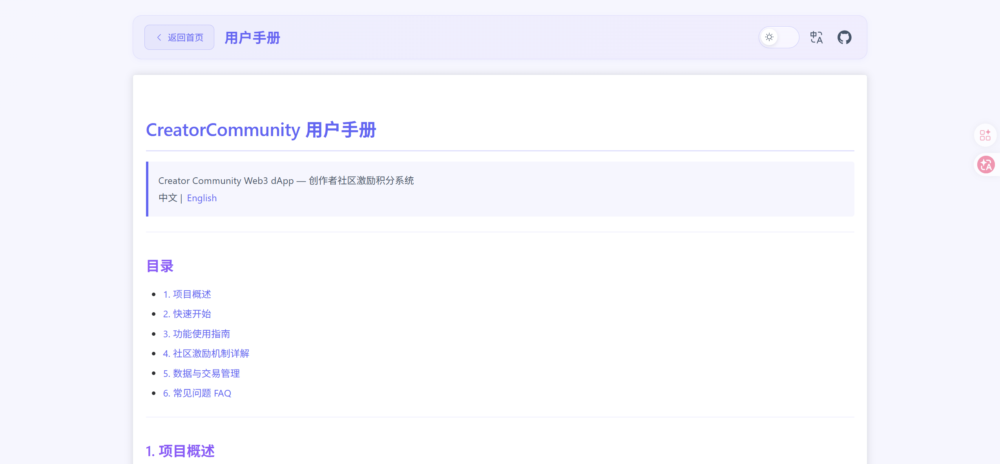

# CreatorCommunity

**简体中文** | [English](./README.en.md)

## 目录

- [项目概述](#项目概述)
- [界面预览](#界面预览)
- [功能特性](#功能特性)
- [技术栈](#技术栈)
- [智能合约](#智能合约)
- [快速开始](#快速开始)
- [项目结构](#项目结构)
- [架构设计](#架构设计)
- [Web3 注意事项](#web3-注意事项)
- [贡献](#贡献)
- [许可](#许可)

## 项目概述

**CreatorCommunity** 是一个基于以太坊的去中心化创作者社区平台，通过 **CTK Token** 与 **CMN NFT 勋章**
的双代币经济模型，构建"创作 → 获取奖励 → 升级勋章 → 更高增益 → 持续创作"的激励机制闭环。

### 代币与 NFT 流转逻辑

```
               发帖 / 评论
          ┌─────────────────────┐
          │   获取 CTK 奖励      │
          │  (基础奖励 + NFT增益)│
          └─────────┬───────────┘
                    │ 累积 CTK
                    ▼
          ┌─────────────────────┐
          │   用 CTK 铸造 NFT    │
          │  青铜(1000)/白银    │
          │  (5000)/黄金(10000) │
          └─────────┬───────────┘
                    │ 持有 NFT
                    ▼
          ┌─────────────────────┐
          │   NFT 增益生效       │
          │  发帖/评论奖励提升   │
          │  (最多可叠加至50%)   │
          └─────────┬───────────┘
                    │ 更多 CTK
                    ▼
          ┌─────────────────────┐
          │   循环：铸造更多 NFT │
          │   或销毁 NFT 变现    │
          └─────────────────────┘
```

### 社区激励机制

1. **创作即挖矿**：用户发帖可获得 CTK 奖励（基础 2 CTK/次，5 分钟冷却），评论可同时让评论者和帖子作者获得 CTK（基础各 0.1
   CTK/次，30 秒冷却）。通过链上记录行为，将内容创作转化为可量化的代币收益。
2. **勋章增益（NFT 越多，收益越大）**：用户持有的 NFT 勋章数量直接影响发帖和评论的奖励额度。每枚青铜 NFT 提供 0.5% 增益、白银
   2%、黄金 12%，增益可累加（上限 50%）。例如：持有 5 枚黄金 NFT 的用户，发帖奖励可提升 50%（2 CTK → 3 CTK）。这鼓励用户持续投入、升级自己的勋章组合。
3. **代币 ↔ 勋章双向兑换**：用户累积的 CTK 可用于铸造三种等级的 NFT 勋章，形成代币消耗通路；同时 NFT 可销毁并返还 80%
   铸造时价格的 CTK，形成回流机制。代币和 NFT 之间形成完整的流通闭环。
4. **NFT 价格波动机制**：管理员可通过 `randomlyAdjustNFTPrice` 函数随机调整 NFT 价格（±10%，受 50%-150%
   初始价格区间约束）。这意味着用户可以在价格低位时铸造 NFT，待价格上涨后销毁，返还的 CTK 可能 **超过**
   当初铸造时的成本，从而产生类似"投资获利"的正向预期，进一步激励用户参与。
5. **四池分配，可持续激励**：CTK 总量 1000 万枚，分为创作者池（400 万）、互动池（200 万）、NFT 池（200 万）、创始人池（200
   万）。创作者池用于发帖奖励发放，互动池用于评论奖励和初始奖励，NFT 池用于 NFT 铸造的代币流通。各池额度独立追踪，防止单一通道过度消耗。

> 一个完整的 Web3 dApp，涵盖钱包连接、智能合约交互、含冷却时间的奖励机制以及 NFT 等级徽章系统。

## 界面预览

### 主界面


### 用户手册



## 功能特性

- **初始奖励领取** — 每个新地址可领取 1 CTK 初始奖励（仅一次）(`claimInitialReward`)
- **发帖奖励** — 发帖获取 CTK 奖励，含 5 分钟冷却时间 (`rewardPost`)
- **评论奖励** — 评论获取 CTK 奖励，评论者和帖子作者双方均可获得奖励，含 30 秒冷却时间 (`rewardComment`)
- **Token 余额** — 实时查询并展示 CTK 余额
- **CTK 转账** — 向任意地址转账 CTK 代币
- **NFT 徽章** — 使用 CTK 铸造三等级 NFT（青铜 / 白银 / 黄金），提供奖励倍率加成
- **NFT 销毁退款** — 销毁 NFT 可返还 80% 铸造成本的 CTK
- **NFT 转移** — 将持有的 NFT 转移给其他地址
- **管理员控制** — 创作者池 / 互动池奖励发放、批量发放、NFT 价格管理、溢出 CTK 提取
- **合约部署** — 从前端界面直接部署 CreatorToken 和 CreatorNFT 合约
- **交易历史** — 采用“账户历史 + 共享历史”双轨本地记录，并提供区块浏览器跳转链接
- **数据缓存** — 以统一 `chainId + tokenAddress` store 缓存链上只读数据、帖子列表和交易历史，store 内再按账户分区
- **中英文与深色模式** — 支持中英文界面、内置用户手册和浅色/深色主题切换
- **内置用户手册** — 访问 `/CreatorCommunity/manual` 查看完整的使用指南

## 技术栈

| 类别          | 技术                                                                              |
|-------------|---------------------------------------------------------------------------------|
| 框架          | [Vue 3](https://cn.vuejs.org/)（Composition API + `<script setup>`）              |
| 构建工具        | [Vite 8](https://cn.vite.dev/)                                                  |
| 路由          | [Vue Router 4](https://router.vuejs.org/)（HTML5 模式，base 路径 `/CreatorCommunity`） |
| Web3 库      | [ethers.js v6](https://docs.ethers.org/v6/)                                     |
| UI 库        | [Element Plus](https://element-plus.org/zh-CN/)                                 |
| Markdown 解析 | [markdown-it](https://github.com/markdown-it/markdown-it)                       |
| 钱包          | MetaMask（BrowserProvider）                                                       |
| 网络          | 以太坊 Sepolia 测试网（Chain ID: `11155111`）                                           |

## 智能合约

本项目与两个智能合约交互：

### CreatorToken（ERC-20，符号：CTK，总量 10,000,000）

具有四池分配机制（创作者池 40%、互动池 20%、NFT 池 20%、创始人池 20%）的 ERC-20 代币。
> 以下列出合约全部函数。部分函数已由前端调用，其余函数预实现但未在前端使用，开发者可自行修改前端代码进行调用。

#### 管理员函数（仅合约 owner 可调用）

| 函数                   | 参数                                   | 说明                                                    |
|----------------------|--------------------------------------|-------------------------------------------------------|
| `sendCreatorReward`  | `(address to, uint256 amount)`       | 从创作者池向指定地址发放 CTK 奖励                                   |
| `sendInteractReward` | `(address to, uint256 amount)`       | 从互动池向指定地址发放 CTK 奖励                                    |
| `batchSendReward`    | `(address[] tos, uint256[] amounts)` | 批量从创作者池发放奖励，上限 100 条                                  |
| `withdrawTokens`     | `(uint256 amount)`                   | 管理员提取代币，按 70% 创作者池 + 30% 互动池比例扣除额度                    |
| `destroyContract`    | 无                                    | 永久停用合约：回收 NFT 合约中的 CTK 余额至 owner，设置 `isPaused = true` |

#### 社区互动函数（发帖 / 评论奖励，记账模式）

采用"先记账、后提现"模式：调用 `rewardPost` / `rewardComment` / `claimInitialReward` 仅记录待领取奖励，需调用对应
`withdraw*` 函数才能将 CTK 转入钱包余额。

| 函数                   | 参数                                 | 说明                                                    |
|----------------------|------------------------------------|-------------------------------------------------------|
| `rewardPost`         | 无                                  | 发帖获取 CTK 奖励（基础 2 CTK + NFT 增益），5 分钟冷却，返回 `postId`     |
| `rewardComment`      | `(address author, uint256 postId)` | 评论获取奖励，评论者和帖子作者双方均获得 CTK（基础各 0.1 CTK + NFT 增益），30 秒冷却 |
| `claimInitialReward` | 无                                  | 领取初始奖励（1 CTK），每地址仅限一次                                 |

#### 奖励提现函数

| 函数                       | 参数 | 说明                           |
|--------------------------|----|------------------------------|
| `withdrawPostRewards`    | 无  | 提取当前地址所有待领取的发帖奖励             |
| `withdrawCommentRewards` | 无  | 提取当前地址所有待领取的评论奖励             |
| `withdrawInitialReward`  | 无  | 提取当前地址待领取的初始奖励               |
| `withdrawAllRewards`     | 无  | 一键提取所有类型的待领取奖励（发帖 + 评论 + 初始） |

#### ERC-20 标准函数

| 函数             | 参数                                           | 说明                 |
|----------------|----------------------------------------------|--------------------|
| `transfer`     | `(address to, uint256 amount)`               | 向指定地址转账 CTK        |
| `approve`      | `(address spender, uint256 amount)`          | 授权第三方地址使用指定额度的 CTK |
| `transferFrom` | `(address from, address to, uint256 amount)` | 从授权地址转账 CTK        |

#### NFT 合约互操作函数（合约间调用）

这些函数仅供 `CreatorNFT` 合约调用，用于两合约间的 CTK 流转与池额度同步。
| 函数 | 参数 | 说明 |
|------|------|------|
| `nftPoolTransfer` | `(address to, uint256 amount)` | 从 NFT 池向指定地址转出 CTK（仅 owner） |
| `transferFromUserForNFT` | `(address from, uint256 amount)` | 从用户地址向 NFT 合约转入 CTK（仅 NFT 合约可调用） |
| `receiveFromNFTToCreatorPool` | `(uint256 amount)` | 接收 NFT 合约退回的 CTK，减少创作者池已用额度（仅 NFT 合约可调用） |
| `receiveFromNFTToInteractPool` | `(uint256 amount)` | 接收 NFT 合约退回的 CTK，减少互动池已用额度（仅 NFT 合约可调用） |
| `transferFromCreatorPoolToNFT` | `(uint256 amount)` | 从创作者池向 NFT 合约转入 CTK（仅 NFT 合约可调用，用于 NFT
销毁退款时补充流动性） |
| `transferFromInteractPoolToNFT` | `(uint256 amount)` | 从互动池向 NFT 合约转入 CTK（仅 NFT 合约可调用） |

#### 只读查询函数

| 函数                        | 参数                 | 返回值                               | 说明                   |
|---------------------------|--------------------|-----------------------------------|----------------------|
| `balanceOf`               | `(address)`        | `uint256`                         | 标准 ERC-20 余额查询       |
| `hasClaimedInitialReward` | `(address)`        | `bool`                            | 是否已领取初始奖励            |
| `lastPostTime`            | `(address)`        | `uint256`                         | 用户上次发帖时间戳            |
| `lastCommentTime`         | `(address)`        | `uint256`                         | 用户上次评论时间戳            |
| `calculateNFTBoost`       | `(address user)`   | `uint256`                         | NFT 奖励增益百分比（上限 50%）  |
| `calculatePostCap`        | `(address user)`   | `uint256`                         | 考虑 NFT 增益后的发帖奖励上限    |
| `calculateCommentCap`     | `(address user)`   | `uint256`                         | 考虑 NFT 增益后的评论奖励上限    |
| `getPendingRewards`       | `(address user)`   | `(post, comment, initial, total)` | 查询用户各类型待领取奖励及总额      |
| `getAuthorByPostId`       | `(uint256 postId)` | `address`                         | 根据帖子 ID 查询作者地址       |
| `postAuthor`              | `(uint256)`        | `address`                         | 帖子 ID → 作者地址映射（公开只读） |
| `postIdCounter`           | 无                  | `uint256`                         | 帖子 ID 自增计数器          |
| `creatorPoolUsed`         | 无                  | `uint256`                         | 创作者池已发放总额            |
| `interactPoolUsed`        | 无                  | `uint256`                         | 互动池已发放总额             |
| `nftPoolUsed`             | 无                  | `uint256`                         | NFT 池已转出总额           |
| `isPaused`                | 无                  | `bool`                            | 合约是否处于暂停状态           |

#### 常量参数

| 常量                        | 值              | 说明            |
|---------------------------|----------------|---------------|
| `TOTAL_SUPPLY`            | 10,000,000 CTK | 代币总供应量        |
| `CREATOR_POOL`            | 4,000,000 CTK  | 创作者激励池总量      |
| `INTERACT_POOL`           | 2,000,000 CTK  | 互动激励池总量       |
| `NFT_POOL`                | 2,000,000 CTK  | NFT 兑换池总量     |
| `FOUNDER_POOL`            | 2,000,000 CTK  | 创始人池总量        |
| `INITIAL_REWARD`          | 1 CTK          | 新用户初始奖励       |
| `POST_REWARD`             | 2 CTK          | 发帖基础奖励        |
| `COMMENT_REWARD`          | 0.1 CTK        | 评论基础奖励        |
| `POST_INTERVAL`           | 300 秒          | 发帖冷却时间        |
| `COMMENT_INTERVAL`        | 30 秒           | 评论冷却时间        |
| `POST_COMMENT_REWARD_CAP` | 3 CTK          | 单帖子评论奖励总上限    |
| `USER_COMMENT_REWARD_CAP` | 0.5 CTK        | 单用户对单帖子评论奖励上限 |
| `MAX_BOOST_RATE`          | 50%            | NFT 增益上限      |
| `MAX_POST_REWARD`         | 10 CTK         | 发帖奖励绝对上限      |
| `MAX_COMMENT_REWARD`      | 2 CTK          | 评论奖励绝对上限      |

### CreatorNFT（ERC-721，符号：CMN）

三等级 NFT 徽章系统：青铜（BRONZE）、白银（SILVER）、黄金（GOLD）。继承 OpenZeppelin 的 `ERC721Enumerable` 和 `ERC721Burnable`。
> 以下列出合约全部函数。部分函数已由前端调用，其余函数预实现但未在前端使用，开发者可自行修改前端代码进行调用。

#### NFT 铸造函数

| 函数              | 参数 | 说明                              |
|-----------------|----|---------------------------------|
| `mintBronzeNFT` | 无  | 铸造青铜 NFT（消耗 CTK，初始价格 1000 CTK）  |
| `mintSilverNFT` | 无  | 铸造白银 NFT（消耗 CTK，初始价格 5000 CTK）  |
| `mintGoldNFT`   | 无  | 铸造黄金 NFT（消耗 CTK，初始价格 10000 CTK） |

内部流程：检查用户 CTK 余额 → 从用户账户转 CTK 到 NFT 合约 → 铸造 NFT → 更新动态提取阈值 → 处理溢出 CTK（超过 200 万 CTK
的部分按比例返还给 CreatorToken 的两个池）。

#### NFT 销毁函数

| 函数                 | 参数                  | 说明                                                                     |
|--------------------|---------------------|------------------------------------------------------------------------|
| `burnNFTForRefund` | `(uint256 tokenId)` | 销毁指定 NFT，返还 80% 铸造价格的 CTK；若 NFT 合约余额不足，自动从 CreatorToken 的创作者池和互动池补充流动性 |
| `burn`             | `(uint256 tokenId)` | 标准 ERC721Burnable 销毁（无 CTK 退款，仅销毁 NFT）                                 |

#### NFT 转移函数

| 函数                 | 参数                                                        | 说明                           |
|--------------------|-----------------------------------------------------------|------------------------------|
| `transferFrom`     | `(address from, address to, uint256 tokenId)`             | 标准 ERC721 转移，自动更新双方 NFT 等级计数 |
| `safeTransferFrom` | `(address from, address to, uint256 tokenId, bytes data)` | 安全转移（含附加数据），自动更新双方 NFT 等级计数  |

#### CTK 提取与溢出处理（管理员）

| 函数                       | 参数   | 说明                                                                                     |
|--------------------------|------|----------------------------------------------------------------------------------------|
| `withdrawCTK`            | 无    | 提取 NFT 合约中超出阈值的 CTK 余额，按 70% 创作者池 + 30% 互动池比例返还给 CreatorToken                          |
| `withdrawAllCTK`         | 无    | 提取 NFT 合约全部可提取 CTK 余额，按 70% 创作者池 + 30% 互动池比例返还                                         |
| `withdrawOverflow`       | 无    | 提取 NFT 合约中超过 200 万 CTK 的溢出部分，按 70% 创作者池 + 30% 互动池比例返还                                  |
| `recoverCTK`             | 无    | 回收 NFT 合约全部 CTK 余额至 CreatorToken 合约，设置 `isPaused = true`（永久停用）                         |
| `checkAndHandleOverflow` | 内部函数 | 当 NFT 合约 CTK 余额超过 200 万（NFT_POOL_INITIAL）时，自动将溢出部分按 70/30 比例返还给 CreatorToken 的创作者池和互动池 |

#### NFT 价格管理（管理员）

| 函数                       | 参数 | 说明                                                |
|--------------------------|----|---------------------------------------------------|
| `randomlyAdjustNFTPrice` | 无  | 随机调整三种 NFT 价格（±10%），受初始值 50%-150% 区间和等级价格关系约束     |
| `resetNFTPrice`          | 无  | 重置三种 NFT 价格为初始值（青铜 1000 / 白银 5000 / 黄金 10000 CTK） |

#### 只读查询函数

| 函数                        | 参数                               | 返回值                      | 说明                                      |
|---------------------------|----------------------------------|--------------------------|-----------------------------------------|
| `nftRank`                 | `(uint256 tokenId)`              | `NFTRank (0/1/2)`        | 查询指定 NFT 的等级                            |
| `nftRankCount`            | `(NFTRank rank)`                 | `uint256`                | 全网各等级 NFT 总数量                           |
| `userNFTRankCount`        | `(address, NFTRank)`             | `uint256`                | 指定用户持有各等级 NFT 数量                        |
| `bronzePrice`             | 无                                | `uint256`                | 当前青铜 NFT 价格                             |
| `silverPrice`             | 无                                | `uint256`                | 当前白银 NFT 价格                             |
| `goldPrice`               | 无                                | `uint256`                | 当前黄金 NFT 价格                             |
| `withdrawalThreshold`     | 无                                | `uint256`                | 当前动态提取阈值（所有 NFT 价值 × 80%）               |
| `getWithdrawableAmount`   | 无                                | `uint256`                | NFT 合约中可提取的 CTK 数量                      |
| `getNFTsByOwner`          | `(address owner)`                | `uint256[]`              | 获取指定用户所有 NFT 的 token ID 列表              |
| `getNFTRankCounts`        | 无                                | `(bronze, silver, gold)` | 全网各等级 NFT 数量统计                          |
| `getNFTRankCountsByOwner` | `(address owner)`                | `(bronze, silver, gold)` | 指定用户各等级 NFT 数量统计                        |
| `getUserNFTRankCount`     | `(address user, uint8 rank)`     | `uint256`                | 指定用户指定等级 NFT 数量（rank: 0=青铜, 1=白银, 2=黄金） |
| `balanceOf`               | `(address owner)`                | `uint256`                | 标准 ERC-721 查询用户 NFT 持有数量                |
| `ownerOf`                 | `(uint256 tokenId)`              | `address`                | 标准 ERC-721 查询 NFT 持有者地址                 |
| `tokenOfOwnerByIndex`     | `(address owner, uint256 index)` | `uint256`                | ERC-721Enumerable 按索引查询用户 NFT           |
| `totalSupply`             | 无                                | `uint256`                | ERC-721Enumerable 全网 NFT 总供应量           |
| `tokenByIndex`            | `(uint256 index)`                | `uint256`                | ERC-721Enumerable 按索引查询全网 NFT           |
| `isPaused`                | 无                                | `bool`                   | 合约是否处于暂停状态                              |

#### 常量参数

| 常量                      | 值             | 说明                |
|-------------------------|---------------|-------------------|
| `MIN_BALANCE_THRESHOLD` | 10,000 CTK    | 合约最低 CTK 余额阈值     |
| `NFT_POOL_INITIAL`      | 2,000,000 CTK | NFT 池初始注入金额       |
| `CREATOR_POOL_RATIO`    | 70            | 溢出分配比例 — 创作者池占比   |
| `INTERACT_POOL_RATIO`   | 30            | 溢出分配比例 — 互动池占比    |
| `INITIAL_BRONZE_PRICE`  | 1,000 CTK     | 青铜 NFT 初始价格（调价基准） |
| `INITIAL_SILVER_PRICE`  | 5,000 CTK     | 白银 NFT 初始价格（调价基准） |
| `INITIAL_GOLD_PRICE`    | 10,000 CTK    | 黄金 NFT 初始价格（调价基准） |

## 快速开始

### 环境要求

- **Node.js** `^20.19.0` 或 `>=22.12.0`
- **MetaMask** 浏览器插件（或其他兼容的 Web3 钱包）
- **以太坊 Sepolia 测试网** 访问权限（在 MetaMask 中添加 Sepolia 网络并从水龙头获取测试 ETH）

### 安装依赖

```bash
# 克隆仓库
git clone https://github.com/anweicaiwei/CreatorCommunity.git
cd creatorcommunity
# 安装依赖
npm install
```

### 本地开发

```bash
# 启动开发服务器（支持热重载）
npm run dev
```

应用将在 `http://localhost:5173/CreatorCommunity/` 启动。

- 首页：`http://localhost:5173/CreatorCommunity/`
- 用户手册：`http://localhost:5173/CreatorCommunity/manual`

### 生产构建

```bash
# 构建生产版本（已压缩）
npm run build
# 本地预览生产构建
npm run preview
```

### 环境变量（可选）

可复制 `.env.example` 为 `.env`，或在项目根目录手动创建 `.env` 文件以覆盖默认网络配置：

```env
VITE_TARGET_CHAIN_ID=11155111
VITE_NETWORK_NAME=Sepolia Testnet
VITE_RPC_URL=https://ethereum-sepolia-rpc.publicnode.com
VITE_BLOCK_EXPLORER=https://sepolia.etherscan.io
```

## 项目结构

```
creatorcommunity/
├── public/                      # 静态资源
│   ├── md_img/                  # README 与手册截图
│   ├── user-manual.zh.md        # 中文用户手册（Markdown）
│   └── user-manual.en.md        # English user manual (Markdown)
├── src/
│   ├── assets/                  # 全局样式与 Logo
│   │   ├── base.css
│   │   └── main.css
│   ├── components/              # Vue UI 组件
│   │   ├── HomeView.vue         # 首页视图
│   │   ├── ManualView.vue       # 用户手册视图
│   │   ├── WalletSection.vue    # 钱包连接/断开与网络状态指示
│   │   ├── DeploySection.vue    # 合约部署面板
│   │   ├── RewardSection.vue    # 领取奖励与 CTK 转账
│   │   ├── PostSection.vue      # 发帖/评论奖励操作与帖子列表
│   │   ├── NFTSection.vue       # NFT 铸造、销毁、转移面板
│   │   ├── AdminSection.vue     # 管理员专属控制面板（仅 owner）
│   │   ├── ChainDataSection.vue # 侧边栏：余额、冷却时间、NFT 信息
│   │   ├── TxHistorySection.vue # 交易历史记录
│   │   ├── TransferSection.vue  # 资产转账 UI（CTK + NFT）
│   │   └── card.vue             # 通用卡片容器组件
│   ├── composables/             # Vue Composition API 逻辑钩子
│   │   ├── useWallet.js         # 钱包连接、Provider/Signer、网络校验
│   │   ├── useTransaction.js    # 基础交易状态管理（pending/success/fail）
│   │   ├── useCommunityData.js  # 账户快照、帖子、池子与缓存刷新
│   │   ├── useCommunityTransactions.js # 交易执行、历史记录与交易后刷新
│   │   ├── useCommunityActions.js      # 部署、奖励、NFT、管理员等业务动作
│   │   ├── useAppProvide.js     # 应用级上下文注入
│   │   ├── useDeploy.js         # 合约部署逻辑
│   │   ├── useContractAddress.js# 合约地址管理（按链存储）
│   │   └── useDataStore.js      # 统一数据缓存与状态管理
│   ├── contracts/               # 合约 ABI 与字节码
│   │   ├── CreatorToken_ABI.json
│   │   ├── CreatorNFT_ABI.json
│   │   ├── CreatorToken.sol     # Solidity 源码（参考）
│   │   ├── CreatorNFT.sol       # Solidity 源码（参考）
│   │   ├── CreatorToken_Bytecode
│   │   ├── CreatorNFT_Bytecode
│   │   └── index.js             # 合约工厂与统一导出
│   ├── router/                  # 路由配置
│   │   └── index.js             # Vue Router 配置
│   ├── locales/                 # 中英文界面文案
│   ├── utils/
│   │   ├── constants.js         # Token 精度、NFT 等级常量
│   │   └── format.js            # 格式化工具（金额、地址、时间）
│   ├── config.js                # 网络配置（支持环境变量）
│   ├── App.vue                  # 应用装配层与上下文提供
│   └── main.js                  # 应用入口
├── .env.example                 # 环境变量模板
├── index.html
├── package.json
└── vite.config.js               # Vite 配置（base: /CreatorCommunity）
```

## 架构设计

```
用户浏览器（MetaMask）
        │
        ▼
  ethers.js BrowserProvider  ←─ 写入交易需钱包签名
        │
        ├── Provider（只读调用）
        └── Signer（签名交易）
                │
                ▼
        CreatorToken 合约  ──  ERC20 + 奖励池
        CreatorNFT 合约    ──  ERC721 + 等级徽章
                │
                ▼
        以太坊 Sepolia 网络
```

- **只读调用**：通过 `Provider` 直接调用，无需 Gas 和签名，结果由 `useDataStore` 写入统一根 store 下的账户快照
- **写入交易**：通过 `Signer` 发起，完整生命周期由 `useTransaction` 管理（预估 Gas → 等待确认 → 解析回执 → 区块浏览器链接）
- **数据缓存**：localStorage 以 `chainId + tokenAddress` 作为统一根键，账户数据、冷却状态和交易历史在 store
  内按账户分区；发生转账、评论奖励等共享交易时，会联动刷新直接受影响账户的缓存

## Web3 注意事项

- **需要钱包**：必须安装并连接 Web3 钱包（如 MetaMask）才能使用链上功能
- **网络要求**：应用目标网络为 **以太坊 Sepolia 测试网**（Chain ID: `11155111`）。如果钱包处于其他网络，应用会提示切换
- **Gas 费用**：所有写入操作（发帖、评论、铸造、转账等）均消耗 ETH 作为 Gas，请确保 Sepolia 钱包中有测试 ETH
- **不可撤销**：区块链交易一旦确认无法撤销，请在签名前仔细确认
- **安全性**：前端代码不存储任何私钥，所有签名操作由用户钱包插件完成

## 贡献

欢迎提交 Issue 和 Pull Request 来改进项目。

## 许可

本项目为个人学习与演示项目，暂未附加开源许可证。代码公开用于学习交流；如需复制、分发或用于其他项目，请先联系作者确认。
