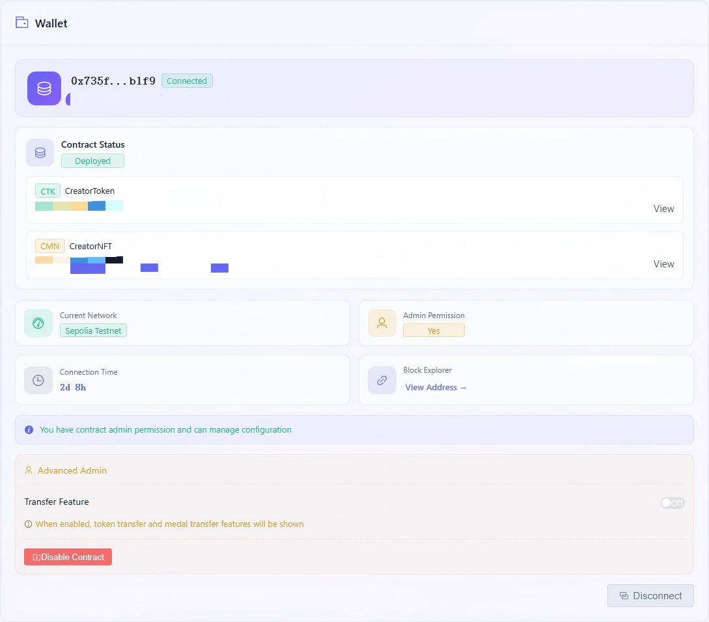
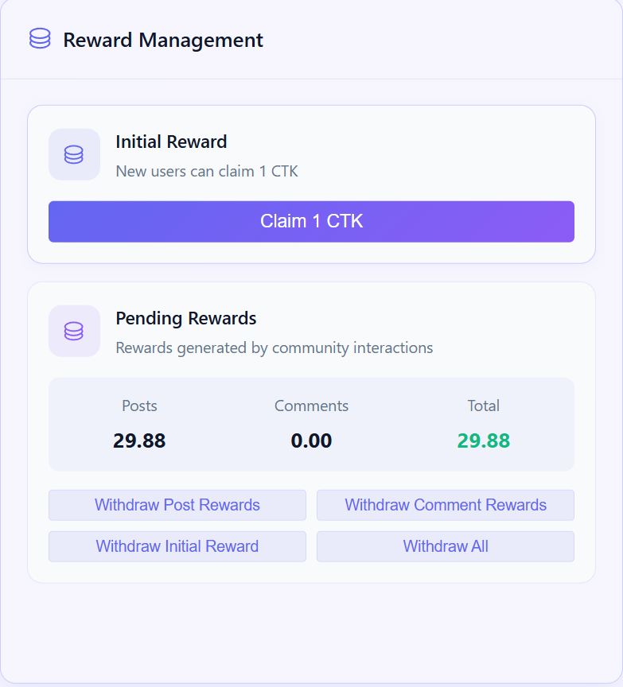
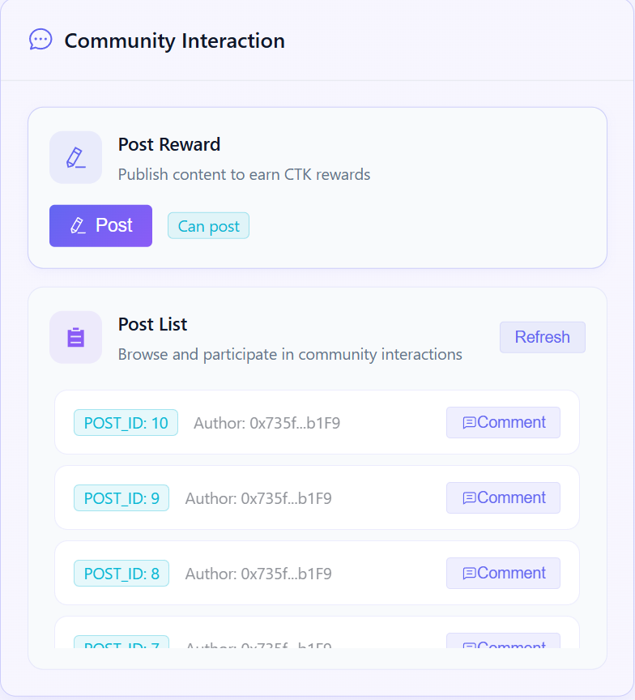
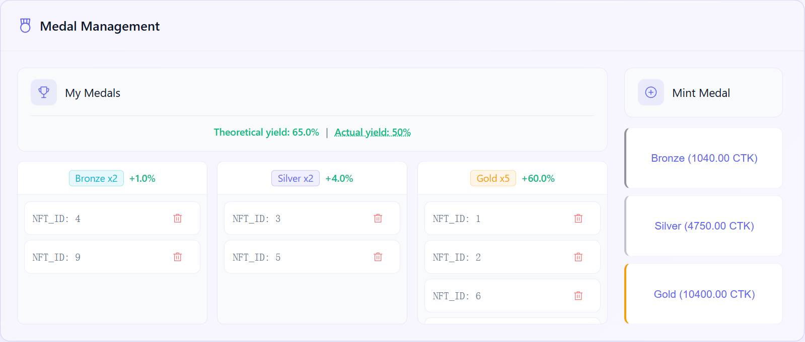
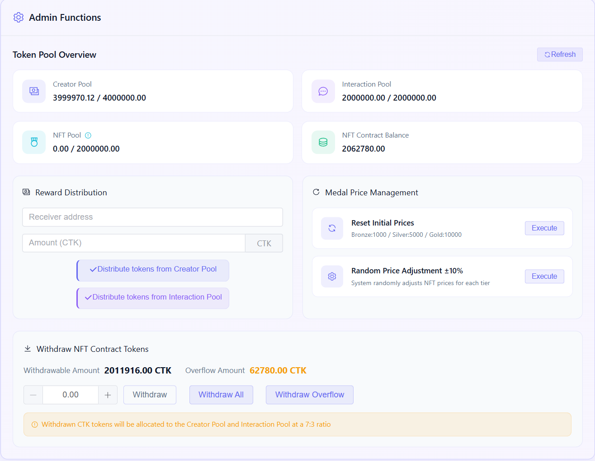
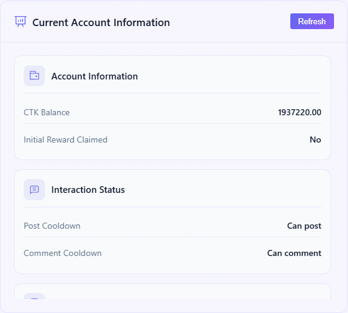
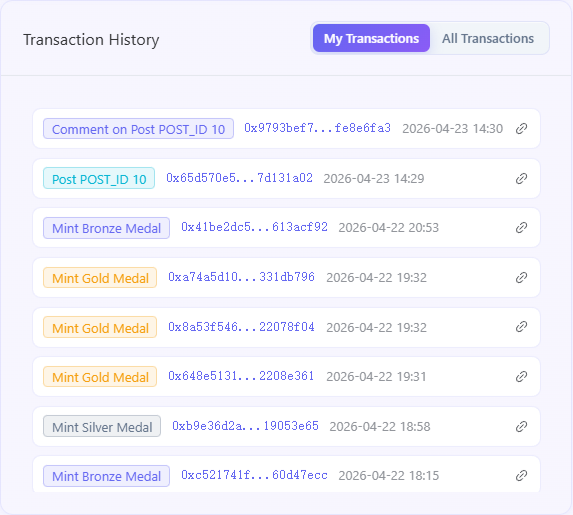

# CreatorCommunity User Manual
> Creator Community Web3 dApp — Creator Incentive Points System
[中文](./user-manual.zh.md) | **English** 
---
## Table of Contents
- [1. Project Overview](#1-project-overview)
- [2. Quick Start](#2-quick-start)
- [3. Feature Usage Guide](#3-feature-usage-guide)
- [4. Community Incentive Mechanism Details](#4-community-incentive-mechanism-details)
- [5. Data & Transaction Management](#5-data-transaction-management)
- [6. FAQ](#6-faq)
---
## 1. Project Overview
**CreatorCommunity** is a decentralized creator community platform (dApp) built on Ethereum, using a dual-token economic model of **CTK Token (ERC-20)** and **CMN NFT Medals (ERC-721)** to create a closed incentive loop: "Create → Earn Rewards → Upgrade Medals → Higher Boost → Keep Creating".
### Core Values
- **Creation = Mining**: Earn CTK token rewards through on-chain actions like posting and commenting, turning content creation into quantifiable economic benefits
- **NFT Boost System**: The more NFT medals you hold, the higher the token reward multiplier for posting and commenting (up to 50% boost)
- **Two-way Circulation Loop**: CTK can be used to mint NFTs, and NFTs can be burned to refund CTK, forming a complete token/NFT circulation cycle
- **Sustainable Incentives**: Four independent pools (total 10 million CTK) prevent excessive consumption from a single channel, ensuring long-term system operation
### Platform Features
| Feature | Description |
|---------|-------------|
| Wallet Connection | Supports MetaMask and other Web3 wallets, one-click connection |
| Smart Contract Interaction | Directly interact with on-chain contracts via ethers.js v6, all data is public and transparent |
| Cooldown Mechanism | 5-minute cooldown for posting, 30-second cooldown for commenting to prevent farming and ensure fairness |
| NFT Tiered Medals | Bronze/Silver/Gold three-tier NFTs, each providing different reward multiplier boosts |
| Asset Transfer | Supports CTK token transfer and NFT medal transfer |
| Built-in User Manual | Access `/CreatorCommunity/manual` for complete usage guide |
---
## 2. Quick Start
### 2.1 Environment Preparation
#### Prerequisites
1. **Install MetaMask Wallet**
   - Go to [metamask.io](https://metamask.io) to download and install the browser plugin
   - Create or import an Ethereum wallet account
2. **Switch to Sepolia Testnet**
   - Open MetaMask, click the network selector in the top left corner
   - Search for and add the "Sepolia" testnet
   - If not automatically displayed, manually add the network:
     - Network Name: `Sepolia Testnet`
     - RPC URL: `https://ethereum-sepolia-rpc.publicnode.com`
     - Chain ID: `11155111`
     - Currency Symbol: `ETH`
     - Block Explorer: `https://sepolia.etherscan.io`
3. **Get Test ETH (choose one of the following methods)**
   - Go to [Sepolia Faucet](https://sepoliafaucet.com) to claim test ETH (requires 0.01 ETH on mainnet to claim)
   - Go to [PoWFaucet](https://sepolia-faucet.pk910.de/): Mine test ETH locally on the Sepolia test network using your CPU. Mining for 2-3 minutes can get you more than 0.2 test ETH, actual amount depends on your CPU performance.
#### Access the Application
- **Local Development**: Run `npm run dev`, visit `http://localhost:5173/CreatorCommunity/` in your browser
- **Production Environment**: Visit the deployed website address
### 2.2 Wallet Connection
1. Open the application page, click the **"Connect Wallet"** button at the top of the page
2. MetaMask will pop up an authorization window, select your account and click **"Connect"**
3. After successful connection, the page will display:
   - Your wallet address (abbreviated, e.g., `0x1234...5678`)
   - Current network name (Sepolia Testnet)
   - ETH balance
> **Tip**: If your wallet is on a non-Sepolia network, the system will prompt you to switch to the correct network.

The wallet card shows connection status, current account, ETH/CTK balances, and network information:



### 2.3 Contract Deployment (First Use)
If the contract has not been deployed to the current network, you can deploy it directly through the frontend interface:
1. After connecting your wallet, find the **"Contract Deployment"** section
2. Click the **"Deploy CreatorToken Contract"** button
   - MetaMask will pop up a transaction confirmation window
   - Confirm the Gas fee, click **"Confirm"**
   - Wait for the transaction to be confirmed on-chain (about 15-30 seconds)
   - After successful deployment, the page will display the contract address
3. CreatorToken contract will automatically create the associated CreatorNFT contract when deployed
4. The contract address will be automatically saved to local storage, no need to redeploy after refreshing the page
> **Note**: Deploying the contract requires a certain amount of ETH as Gas fee, please ensure your wallet balance is sufficient.
### 2.4 First Time Operation Guide
After connecting your wallet and confirming the contract is deployed, it is recommended to follow these steps:
1. **Claim Initial Reward** → Click "Claim Initial Reward" to get 1 CTK starting capital
2. **Withdraw Reward** → Click "Withdraw Initial Reward" to transfer CTK to your wallet balance
3. **Post for Reward** → Click "Post Reward" to record your first post action and earn CTK
4. **Comment for Reward** → Enter the author address and post ID, click "Comment Reward"
5. **Mint NFT** → After accumulating enough CTK, mint NFT medals to get reward multiplier boost
---
## 3. Feature Usage Guide
### 3.1 Initial Reward Claim
**Function Description**: Each new address can claim 1 CTK initial token for free, only once.

The reward card brings together the initial reward, pending post/comment rewards, and withdrawal actions:



**Operation Steps**:
1. After connecting your wallet, find the **"Claim Initial Reward"** button in the "Rewards Panel"
2. Click the button, MetaMask will pop up a transaction confirmation window
3. Confirm the transaction details, click **"Confirm"**
4. Wait for the transaction to be confirmed on-chain
5. After successful claim, 1 CTK will be recorded as your "Pending Initial Reward"
**Important Notes**:
- After claiming, CTK will not be directly transferred to your wallet balance, but will be recorded as "Pending"
- You need to perform an additional **"Withdraw Initial Reward"** operation for CTK to be actually transferred to your wallet
- Addresses that have already claimed cannot claim again, the button will be disabled
### 3.2 Post Reward
**Function Description**: Earn CTK rewards through on-chain posting actions, base reward 2 CTK per post, with NFT boost available.

Posting and commenting actions are handled in the content interaction card, where cooldown state is also shown:



**Operation Steps**:
1. In the "Post Reward" section, click the **"Post"** button
2. MetaMask will pop up a transaction confirmation window
3. Confirm the transaction, wait for on-chain confirmation
4. After successful transaction:
   - The system returns the post ID (`postId`)
   - The corresponding CTK reward is recorded as "Pending Post Reward"
   - Enter 5-minute cooldown period
**Cooldown Mechanism**:
- After each post, your address enters a **5-minute (300-second)** cooldown period
- You cannot post again for rewards during the cooldown period
- The page will display a cooldown countdown, the button will be available again after the countdown ends
- Cooldown time is calculated from on-chain timestamps, not affected by local clock

**Reward Calculation Examples**:

| NFT Holdings | Post Reward |
|-------------|-------------|
| No NFT | 2 CTK (base reward) |
| 1 Bronze NFT | 2.01 CTK (+0.5%) |
| 1 Silver NFT | 2.04 CTK (+2%) |
| 1 Gold NFT | 2.24 CTK (+12%) |
| 5 Gold NFTs | 3 CTK (+50%, reaches boost cap) |
| Any higher boost | Max 10 CTK (absolute cap) |

### 3.3 Comment Reward
**Function Description**: Comment on existing posts, both commenter and post author will earn CTK rewards, base 0.1 CTK each per comment.
**Operation Steps**:
1. In the "Comment Reward" section, enter the following information:
   - **Author Address**: Wallet address of the post author (`0x...` format)
   - **Post ID**: `postId` returned when the post was made (number)
2. Click the **"Comment"** button
3. MetaMask will pop up a transaction confirmation window
4. Confirm the transaction, wait for on-chain confirmation
5. After successful transaction, both commenter and author will receive corresponding CTK rewards (recorded as "Pending")
**Cooldown Mechanism**:
- After each comment, the commenter address enters a **30-second** cooldown period
- You cannot comment again for rewards during the cooldown period

**Reward Limits**:

| Limit Type | Rule |
|-----------|------|
| Single user on single post | Cumulative comment reward cap 0.5 CTK |
| Total comment reward for single post | Cumulative cap 3 CTK |
| Personal comment reward absolute cap | Max 2 CTK per comment (including NFT boost) |

**Reward Distribution Notes**:
- Commenter receives: Base 0.1 CTK + NFT boost
- Post author receives: Base 0.1 CTK + NFT boost
- Boost for both parties is calculated independently based on their respective NFT holdings
- You cannot comment on your own posts for rewards (transaction reverts when `msg.sender == author`)
### 3.4 Reward Withdrawal
**Function Description**: All CTK obtained through posting, commenting, and initial claim are in "Pending" status, you need to perform a withdrawal operation to transfer them to your wallet balance.
**Operation Steps**:
1. Find the reward withdrawal section in the "Rewards Panel"
2. Choose withdrawal type:
   - **Withdraw Post Rewards** — Withdraw all pending post rewards
   - **Withdraw Comment Rewards** — Withdraw all pending comment rewards
   - **Withdraw Initial Reward** — Withdraw pending initial reward
   - **Withdraw All Rewards** — One-click withdrawal of all types of pending rewards
3. Click the corresponding button, confirm the transaction
4. After successful transaction, CTK will be directly transferred to your wallet balance
> **Tip**: It is recommended to use the "Withdraw All Rewards" function to complete all types of withdrawals in one operation, saving Gas fees.
### 3.5 CTK Transfer
**Function Description**: Transfer CTK tokens to any Ethereum address.
**Operation Steps**:
1. In the "Transfer Panel", select the **"CTK Transfer"** tab
2. Enter the following information:
   - **Receiver Address**: Target wallet address (`0x...` format)
   - **Transfer Amount**: Amount of CTK to transfer
3. Click the **"Transfer"** button
4. MetaMask will pop up a transaction confirmation window, confirm the amount and receiver address
5. Confirm the transaction, wait for on-chain confirmation
6. After successful transaction, CTK will be transferred from your balance to the target address
> **Note**: Please confirm the receiver address is correct before transferring, blockchain transactions cannot be reversed once initiated.
### 3.6 Token Balance Query
**Function Description**: Real-time view of CTK balance for the current wallet address.
**View Method**:
- After connecting your wallet, the sidebar will automatically display your CTK balance
- Balance data is obtained through on-chain read calls, no Gas fee required
- Balance will automatically refresh after any transaction operation
**Address Formatting**:
- Wallet address is displayed in abbreviated format (e.g., `0x1234...5678`)
- Click the address to copy the full address
### 3.7 NFT Medal Minting
**Function Description**: Use CTK to mint three tiers of NFT medals, holding NFTs provides reward multiplier boosts for posting and commenting.

The NFT card shows current prices, owned NFT counts, mint/burn actions, and NFT transfer-related status:



#### NFT Tiers & Prices
| Tier | Initial Price | Boost per NFT | Post Cap Boost per NFT | Comment Cap Boost per NFT |
|------|--------------|--------------|------------------------|---------------------------|
| Bronze (BRONZE) | 1,000 CTK | +0.5% | +0.2 CTK | +0.05 CTK |
| Silver (SILVER) | 5,000 CTK | +2% | +1.5 CTK | +0.3 CTK |
| Gold (GOLD) | 10,000 CTK | +12% | +6 CTK | +1.8 CTK |
#### Minting Operation Steps
1. View current NFT prices for each tier in the "NFT Panel"
2. Confirm your CTK balance >= target NFT price
3. Click the **"Mint"** button for the corresponding tier (e.g., "Mint Bronze NFT")
4. MetaMask will pop up a transaction confirmation window
5. Confirm the transaction, wait for on-chain confirmation
6. After successful minting:
   - You will receive a new NFT (assigned unique `tokenId`)
   - Corresponding amount of CTK will be deducted from your balance
   - Your post/comment reward boost takes effect immediately
   - NFT price may trigger overflow handling (automatically return excess CTK to reward pools)
#### NFT Boost Stacking Rules
- Boost is stacked linearly based on NFT holdings: `Total Boost = Bronze Count × 0.5% + Silver Count × 2% + Gold Count × 12%`
- Boost cap is **50%**, excess is invalid
- Example: Holding 4 Gold NFTs = 48% boost; Holding 5 = 60% → actual effective 50%
#### NFT Minting Internal Flow
```
User initiates mint
        │
        ▼
Check CTK balance >= NFT price?
        │ Yes
        ▼
Transfer CTK from user account to NFT contract
        │
        ▼
Mint NFT (assign tokenId, record tier)
        │
        ▼
Update dynamic withdrawal threshold (+ price × 80%)
        │
        ▼
Check overflow: NFT contract balance > 2M CTK?
        │ Yes → 70% of overflow returned to creator pool, 30% to interaction pool
        │ No → End
        ▼
Minting complete
```
### 3.8 NFT Burn & Refund
**Function Description**: Burn owned NFT medals, refund 80% of the current price of the corresponding NFT tier in CTK.
#### Operation Steps
1. View your NFT holdings list in the "NFT Panel"
2. Select the NFT to burn (confirm `tokenId`)
3. Click the **"Burn NFT"** button
4. MetaMask will pop up a transaction confirmation window
5. Confirm the transaction, wait for on-chain confirmation
6. After successful burn:
   - NFT is permanently destroyed (removed from chain)
   - 80% of the current price of the corresponding NFT tier in CTK is refunded to your wallet balance
   - Your NFT boost is reduced accordingly
#### Refund Amount Calculation
Refund Amount = Current price of the NFT tier at burn time × 80%
| Scenario | Mint Price | Current Price | Refund Amount |
|----------|------------|---------------|---------------|
| Price unchanged | 1,000 CTK (Bronze) | 1,000 CTK | 800 CTK |
| Price increased | 1,000 CTK (Bronze) | 1,100 CTK | 880 CTK |
| Price decreased | 1,000 CTK (Bronze) | 900 CTK | 720 CTK |
> **Note**: Due to possible NFT price fluctuations, the refund amount at burn time may be higher or lower than your actual cost when minting. If you burn after a 10% price increase, the refund (88% of mint cost) will exceed 80% of your original investment.
#### Liquidity Guarantee
If the CTK balance in the NFT contract is insufficient to pay the refund, the system will automatically supplement liquidity from the creator pool and interaction pool of the CreatorToken contract to ensure the refund is executed normally.
### 3.9 NFT Transfer
**Function Description**: Transfer your owned NFT medals to other Ethereum addresses.
#### Operation Steps
1. In the "Transfer Panel", select the **"NFT Transfer"** tab
2. Enter the following information:
   - **Receiver Address**: Target wallet address (`0x...` format)
   - **NFT Token ID**: ID of the NFT to transfer (viewable in NFT list)
3. Click the **"Transfer NFT"** button
4. MetaMask will pop up a transaction confirmation window, confirm the receiver address and Token ID
5. Confirm the transaction, wait for on-chain confirmation
6. After successful transaction:
   - NFT will be transferred from your account to the target address
   - Your NFT boost is reduced accordingly
   - Receiver's NFT boost is increased accordingly
> **Note**: Please confirm the receiver address is correct before transferring NFT, blockchain transactions cannot be reversed once initiated.
### 3.10 Admin Functions
**Function Description**: Management function panel only visible and operable by contract owner (deployer).
> Regular users cannot see this panel. If you do not see the following functions, your current wallet is not the contract owner. This is permission control at the contract level (`onlyOwner` modifier).

The admin card is only shown after the owner wallet is connected, and is used for reward-pool distribution, NFT price management, overflow withdrawal, and contract deactivation:



#### Creator Pool Reward Distribution
- **Function**: Distribute rewards from the creator pool (4 million CTK) to a specified address
- **Operation**: Enter target address and distribution amount (CTK), click "Distribute"
- **Limit**: Total distribution cannot exceed creator pool total amount
#### Interaction Pool Reward Distribution
- **Function**: Distribute rewards from the interaction pool (2 million CTK) to a specified address
- **Operation**: Enter target address and distribution amount (CTK), click "Distribute"
- **Limit**: Total distribution cannot exceed interaction pool total amount
#### NFT Price Management
- **Random Price Adjustment**: Click "Random Adjust Price", the system will adjust the three NFT prices by ±10% based on on-chain random numbers (constrained within 50%-150% of initial values)
- **Reset Price**: Click "Reset Price", restore all three NFT prices to initial values (Bronze 1000 / Silver 5000 / Gold 10000 CTK)
#### Overflow CTK Withdrawal
- **Withdraw Overflow CTK**: Withdraw the overflow part of CTK in the NFT contract exceeding 2 million CTK, returned at 70% creator pool + 30% interaction pool ratio
- **Withdraw All Withdrawable CTK**: Withdraw all withdrawable CTK balance in the NFT contract, returned at 70% creator pool + 30% interaction pool ratio
- **Withdraw Specified Amount CTK**: Enter withdrawal amount, withdraw corresponding amount of CTK from NFT contract, returned at 70% creator pool + 30% interaction pool ratio
#### Contract Deactivation
- **Function**: Permanently deactivate the contract (emergency operation)
- **Operation**: Click "Deactivate Contract"
- **Effect**: Recover all CTK balance from NFT contract, set `isPaused = true`, all write operations are prohibited (except withdrawals)
---
## 4. Community Incentive Mechanism Details
### 4.1 Four Pool Allocation Model
Total CTK supply **10,000,000 tokens**, allocated to four independent pools at fixed ratios:

The on-chain data card shows contract addresses, pool status, and core on-chain statistics for comparison with the four-pool model below:



```
Total Supply: 10,000,000 CTK
├── Creator Incentive Pool   4,000,000 CTK  (40%)  ← Post reward distribution
├── Interaction Incentive Pool     2,000,000 CTK  (20%)  ← Comment rewards + initial rewards
├── NFT Exchange Pool     2,000,000 CTK  (20%)  ← NFT minting token circulation
└── Founder Pool       2,000,000 CTK  (20%)  ← Held by contract owner
```
#### Pool Responsibilities & Characteristics
| Pool Name | Purpose | Consumption Method | Recovery Method |
|-----------|---------|--------------------|-----------------|
| Creator Pool | Post reward distribution | `rewardPost` consumes quota | NFT overflow return, admin `withdrawTokens` |
| Interaction Pool | Comment rewards + initial claims | `rewardComment` + `claimInitialReward` consume | NFT overflow return, admin `withdrawTokens` |
| NFT Pool | CTK circulation during NFT minting | CTK transferred to NFT contract when minting | NFT burn refund, automatic return during overflow handling |
| Founder Pool | Held by contract deployer | Transferred directly to owner at deployment | — |
#### Independent Tracking, Prevent Overconsumption
- Used quota for each pool (`creatorPoolUsed`, `interactPoolUsed`, `nftPoolUsed`) is tracked independently
- Remaining quota for the corresponding pool is verified before any consumption operation
- When pool quota is exhausted, corresponding operations will be rejected (contract revert)
- Admin can withdraw from both creator and interaction pools at 70:30 ratio via `withdrawTokens`
### 4.2 Cooldown Time Design
#### Cooldown Parameters
| Operation | Cooldown Time | Design Purpose |
|-----------|---------------|----------------|
| Post (`rewardPost`) | 5 minutes (300 seconds) | Prevent mass posting for rewards in short time |
| Comment (`rewardComment`) | 30 seconds | Prevent high-frequency commenting from automated scripts |
#### Significance of Anti-farming Mechanism
1. **Protect Reward Pools**: Cooldown time limits the maximum reward consumption rate per unit time, preventing reward pools from being exhausted quickly
2. **Encourage Real Interaction**: Mandatory intervals ensure each operation represents real user behavior, not programmatic farming
3. **Ecosystem Sustainability**: Combined with the four-pool allocation model, cooldown time controls consumption rhythm from the time dimension, extending the system's sustainable operation cycle
4. **Fairness Guarantee**: All users follow the same cooldown rules, no one can gain unfair reward frequency advantage through technical means
#### Quota Cap Mechanism (Additional Protection Layer)
In addition to cooldown time, comment rewards have additional quota caps:
- **Single user on single post**: Cumulative comment reward cap 0.5 CTK
- **Total comment reward for single post**: Cumulative cap 3 CTK
- **Personal comment reward absolute cap**: Max 2 CTK per comment (including NFT boost)
These limits work together to ensure the system is not abused and reward distribution is fairer.
### 4.3 NFT Tier Incentive System
#### Progressive Tier Design
```
Bronze NFT (1,000 CTK)
        │  Boost +0.5% per NFT
        │  Best cost-effectiveness, suitable for beginners
        ▼
Silver NFT (5,000 CTK)
        │  Boost +2% per NFT (4x price of Bronze, 4x boost efficiency)
        │  Suitable for active creators
        ▼
Gold NFT (10,000 CTK)
            Boost +12% per NFT (2x price of Silver, 6x boost efficiency)
            Suitable for deep participants, highest boost efficiency
```
#### Why Holding More NFTs Gives Higher Returns?
NFT boost is linearly stacked, which means:
- 1 Gold NFT = 12% boost → Post reward increases from 2 CTK to 2.24 CTK
- 4 Gold NFTs = 48% boost → Post reward increases from 2 CTK to 2.96 CTK
- Boost cap 50% → Even if holding a large number of NFTs, boost will not exceed 50%
This design encourages users to:
1. Continuously create to accumulate CTK
2. Invest CTK in NFT minting to increase boost
3. Higher boost leads to more CTK earnings
4. Form a positive cycle
#### Security Guarantee for NFT Burn Refund
- **80% Refund Ratio**: Users can recover most of their investment cost even if they decide to exit
- **Liquidity Guarantee**: Automatically supplement from reward pools when NFT contract balance is insufficient, ensuring refunds can always be executed
- **Price Fluctuation Opportunity**: If you burn after NFT price increases, actual refund may exceed 80% of your original investment
### 4.4 Reward Multiplier Calculation Rules
#### Post Reward Calculation
```
Post Reward = POST_REWARD × (1 + NFT Boost%) = 2 CTK × (1 + Boost%)
Where:
  NFT Boost% = min(Bronze Count × 0.5% + Silver Count × 2% + Gold Count × 12%, 50%)
Final reward must also satisfy:
  - Does not exceed post reward absolute cap: 10 CTK
  - Does not exceed creator pool remaining quota
```
#### Comment Reward Calculation
```
Commenter Reward = COMMENT_REWARD × (1 + Commenter NFT Boost%) = 0.1 CTK × (1 + Commenter Boost%)
Author Reward   = COMMENT_REWARD × (1 + Author NFT Boost%)   = 0.1 CTK × (1 + Author Boost%)
Where:
  Boost for both parties is calculated independently
Final reward must also satisfy:
  - Does not exceed comment reward absolute cap: 2 CTK per comment
  - Single user on single post cumulative does not exceed 0.5 CTK
  - Single post total comment reward does not exceed 3 CTK
  - Does not exceed interaction pool remaining quota
```
#### Impact of NFT on Post/Comment Caps
NFT not only increases actual reward amount, but also increases "single post comment reward total cap" and "user post reward cap":
| NFT Type | Post Cap Boost per NFT | Comment Cap Boost per NFT |
|----------|-------------------------|----------------------------|
| Bronze | +0.2 CTK | +0.05 CTK |
| Silver | +1.5 CTK | +0.3 CTK |
| Gold | +6 CTK | +1.8 CTK |
This means users holding NFTs not only earn more rewards per action, but can also continue earning rewards over a longer period of time.
---
## 5. Data & Transaction Management
### 5.1 Transaction History
#### View Transaction History
The transaction history card records locally initiated transactions, processing status, block height, and block explorer entry points:



1. The **"Transaction History"** section on the page automatically records this app's local transaction history and defaults to the current account's view
2. Each record includes:
   - Transaction Hash (`txHash`)
   - Transaction Status (Success / Failed / Processing)
   - Operation Time
   - Associated Block Height
3. The app keeps both shared history and account history: the current page reads account history by default while shared history still preserves the full local activity log
4. Clicking the transaction hash will redirect to the block explorer detail page to view complete on-chain transaction information
#### Block Explorer Redirection
- After transaction confirmation, the page provides a clickable transaction hash link
- Clicking will open the corresponding transaction detail page on Sepolia Etherscan in a new tab
- In the block explorer you can view: Gas consumption, transaction input data, event logs and other detailed information
### 5.2 Data Caching Mechanism
#### Caching Strategy
The application uses an intelligent caching mechanism to optimize performance and reduce RPC requests:
```
Root Cache Key = chainId + tokenContractAddress
```
- **Unified cache structure**: `useDataStore` keeps `userDataByAccount`, `txHistoryByAccount`, `txHistoryShared`, `pools`, `posts`, and `settings` inside one root store
- **Account snapshots**: Each cached account stores its own balances, pending rewards, NFT data, plus `cooldowns.post` / `cooldowns.comment`
- **Transaction history**: The UI defaults to account history while shared history is still retained for the full local activity log
- **Legacy compatibility**: Old standalone cooldown keys may still be read as a migration fallback, but cooldown state now primarily lives inside the account snapshot
#### Cache Refresh Strategy
| Data Type | Refresh Method |
|-----------|----------------|
| High frequency account data (balance, cooldown, NFT data, etc.) | Automatically refresh the current account after a transaction and also refresh directly affected cached accounts |
| Low frequency data (pool statistics, etc.) | Scheduled refresh |
| Post list | Refreshed after posting operation |
| Transaction history | Appended to both account history and shared history on each new transaction |
#### Cross-chain Isolation
Cached data uses `chainId + tokenAddress` as the root boundary and partitions accounts inside the store, ensuring:
- No incorrect data is loaded after switching networks
- Switching wallets loads the matching account snapshot without overwriting other cached accounts
- Data from different contract addresses on the same network do not interfere with each other
---
## 6. FAQ
### Wallet & Network
**Q: Why can't I connect my wallet?**
A: Please confirm:
1. MetaMask or other compatible Web3 wallet plugin is installed
2. Wallet is unlocked (password entered)
3. Browser is not blocked by security plugins
**Q: My wallet is on Ethereum Mainnet, can I operate?**
A: No. This platform runs on **Sepolia Testnet** (Chain ID: 11155111). Please switch to Sepolia network in MetaMask before operating. After connection, the system will automatically detect if the network matches, and prompt to switch if it does not match.
**Q: How to get Sepolia test ETH?**
A: You can get it for free from the following faucets:
- [sepoliafaucet.com](https://sepoliafaucet.com)
- [Google Cloud Sepolia Faucet](https://cloud.google.com/application/web3/faucet/ethereum/sepolia)
- [Alchemy Sepolia Faucet](https://www.alchemy.com/faucets/ethereum/sepolia)
### Reward Related
**Q: Why did I claim the initial reward but my wallet balance didn't increase?**
A: Rewards use the "account first, withdraw later" model. `claimInitialReward` only records 1 CTK as "Pending Initial Reward", you need to perform an additional `withdrawInitialReward` operation for CTK to be actually transferred to your wallet balance. You can also use `withdrawAllRewards` to withdraw all types of pending rewards in one click.
**Q: Why didn't I get a reward after posting?**
A: Possible reasons:
1. You are in the 5-minute cooldown period, please wait for the cooldown countdown to end
2. Creator pool quota has been exhausted (4 million CTK fully distributed)
3. Contract is in paused state (`isPaused = true`)
**Q: Why does it prompt "User cap reached" when commenting?**
A: The cumulative comment reward cap for a single user on a single post is 0.5 CTK. Your comment reward for this post has reached the cap, please comment on other posts.
**Q: What does "Post cap reached" mean when commenting?**
A: The cumulative comment reward cap for a single post is 3 CTK. The comment reward pool for this post is full, you can post to create a new post.
### Transfer Related
**Q: The recipient didn't receive CTK/NFT after transfer?**
A: Possible reasons:
1. The transaction has not been confirmed by the blockchain yet, please wait a few minutes and check again
2. The receiver address was entered incorrectly, please confirm if the address is correct
3. Insufficient Gas fee caused transaction failure, please check the transaction status in transaction history
**Q: Can I transfer to non-Ethereum addresses?**
A: No. Only transfers to Ethereum compatible addresses (starting with `0x`) are supported. Transferring to other types of addresses will result in asset loss.
### NFT Related
**Q: What should I do if it prompts "Insufficient CTK" when minting NFT?**
A: Your CTK balance is insufficient to pay for NFT minting fees. Please accumulate enough CTK first by posting, commenting, etc., or claim the initial reward and withdraw it to your balance.
| NFT Tier | Required CTK |
|----------|--------------|
| Bronze | ≥ 1,000 CTK |
| Silver | ≥ 5,000 CTK |
| Gold | ≥ 10,000 CTK |
**Q: Where did my CTK go after burning NFT?**
A: After successful burn, 80% of the current price of the corresponding NFT tier in CTK will be directly transferred to your wallet balance. You can view the updated amount in the balance panel.
**Q: Why is the NFT price different from when I minted it?**
A: The contract owner can call the `randomlyAdjustNFTPrice` function to randomly adjust NFT prices by ±10%. Prices will fluctuate within 50%-150% of the initial value. This is normal system design and also creates a "buy low, sell high" investment opportunity for NFT burn refunds.
**Q: Can I transfer my NFT to others?**
A: Yes. NFTs follow the standard ERC-721 protocol, supporting `transferFrom` and `safeTransferFrom` methods for transfer. After transfer, the sender's NFT boost decreases, and the receiver's NFT boost increases.
### Gas & Transactions
**Q: What should I do if the transaction fails?**
A: Common causes and solutions:
1. **Insufficient Gas**: Increase Gas Limit and Gas Price in MetaMask
2. **Insufficient ETH balance**: Get more test ETH from faucets
3. **Contract revert**: Check preconditions (cooldown time, pool quota, permissions, etc.)
4. **Network timeout**: Check network connection and try again later
**Q: The transaction is confirmed but the result is not displayed on the page?**
A: Please refresh the page manually. If the transaction is indeed successful, the on-chain status will not change, and the page data will be synchronized after refresh. You can also go to the block explorer and enter the transaction hash to confirm the transaction status.
### Admin Related
**Q: Why can't I see the admin function panel?**
A: Admin functions are only visible to the contract owner (deployer). If you are not the contract deployer, you cannot see or use these functions. This is permission control at the contract level (`onlyOwner` modifier).
**Q: Can I change the owner after contract deployment?**
A: CreatorToken and CreatorNFT contracts inherit OpenZeppelin's `Ownable` contract, the owner can transfer ownership to a new address via the `transferOwnership` function.
### System Sustainability
**Q: What happens when the reward pool is exhausted?**
A: When a pool's quota is exhausted, corresponding reward operations will be rejected (contract revert):
- Creator pool exhausted → Cannot get post rewards via `rewardPost`
- Interaction pool exhausted → Cannot get comment rewards via `rewardComment`, cannot claim initial rewards
- Users can return CTK to the pools through NFT overflow handling and burn refund mechanisms
**Q: Will there be token inflation in this system?**
A: No. Total CTK supply is fixed at 10,000,000 tokens, minted once at contract deployment. All rewards are transferred from pre-allocated pools, no new tokens are minted.
