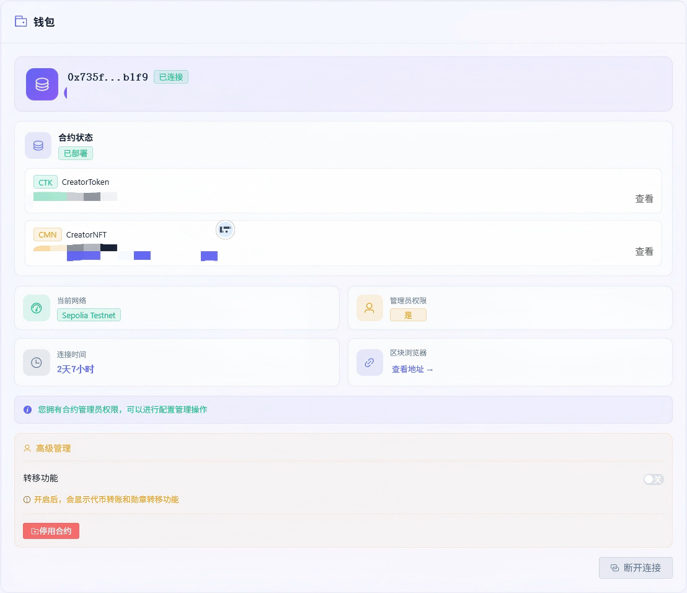
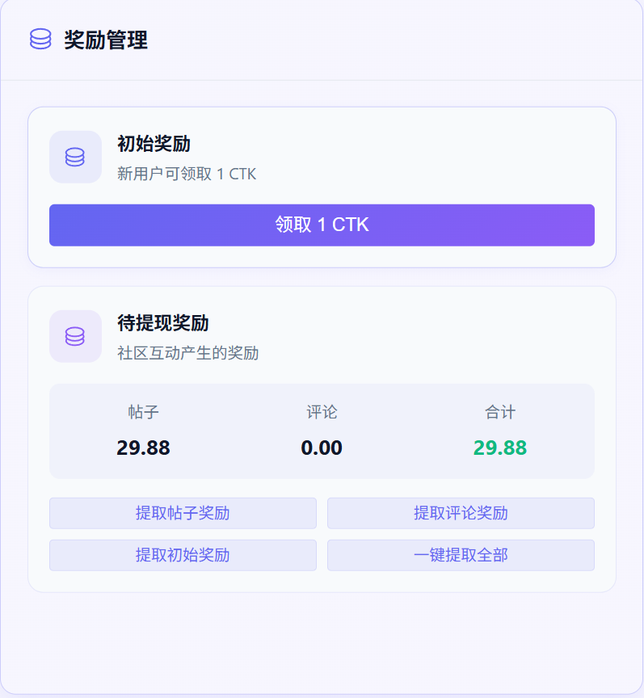
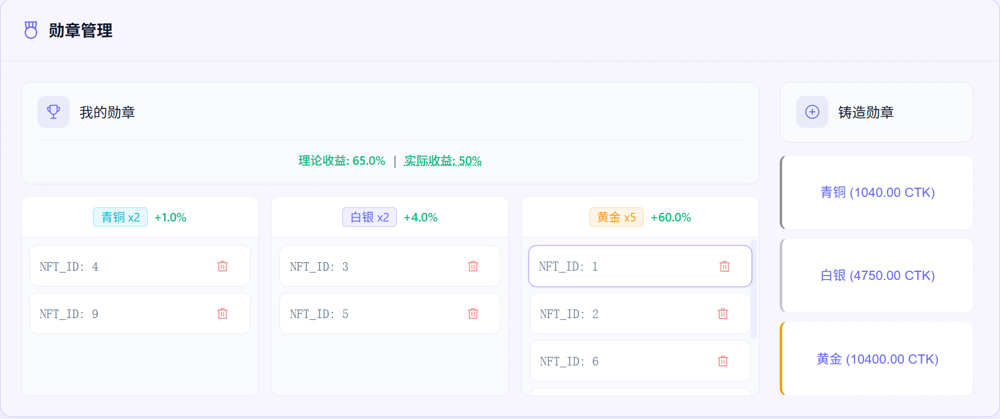
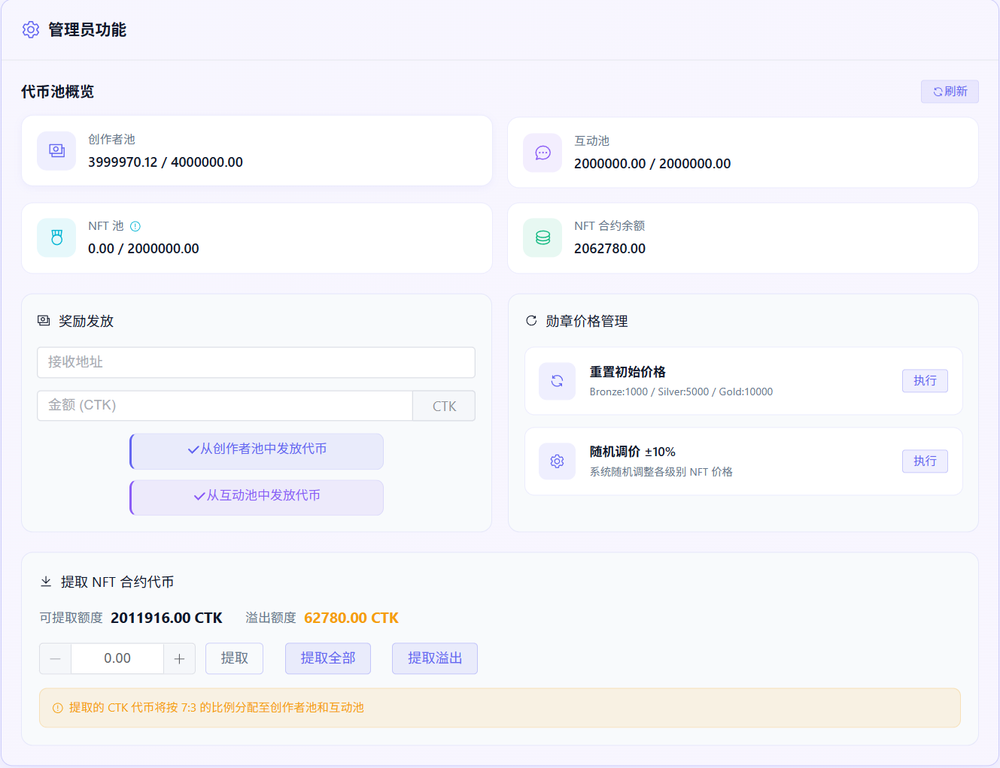
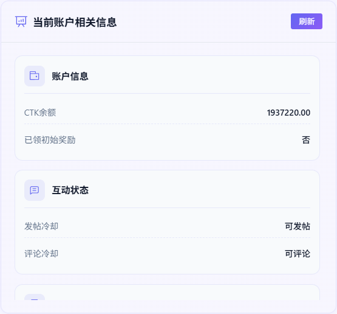
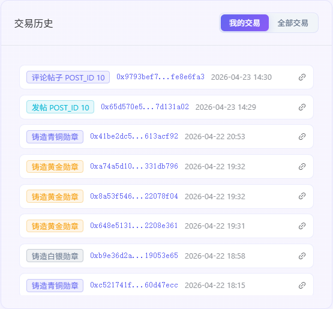

# CreatorCommunity 用户手册
> Creator Community Web3 dApp — 创作者社区激励积分系统
**中文** | [English](./user-manual.en.md)
---
## 目录
- [1. 项目概述](#1-项目概述)
- [2. 快速开始](#2-快速开始)
- [3. 功能使用指南](#3-功能使用指南)
- [4. 社区激励机制详解](#4-社区激励机制详解)
- [5. 数据与交易管理](#5-数据与交易管理)
- [6. 常见问题 FAQ](#6-常见问题-faq)
---
## 1. 项目概述
**CreatorCommunity** 是一个基于以太坊的去中心化创作者社区平台（dApp），通过 **CTK Token（ERC-20）** 与 **CMN NFT 勋章（ERC-721）** 的双代币经济模型，构建"创作 → 获取奖励 → 升级勋章 → 更高增益 → 持续创作"的激励机制闭环。
### 核心价值
- **创作即挖矿**：通过发帖、评论等链上行为获取 CTK 代币奖励，将内容创作转化为可量化的经济收益
- **NFT 增益体系**：持有 NFT 勋章越多，发帖和评论的代币奖励倍率越高（最高 50% 增益）
- **双向流通闭环**：CTK 可铸造 NFT，NFT 可销毁返还 CTK，形成完整的代币/NFT 流通循环
- **可持续激励**：四池独立分配（总量 1000 万 CTK），防止单一通道过度消耗，保障系统长期运行
### 平台特性
| 特性 | 说明 |
|------|------|
| 钱包连接 | 支持 MetaMask 等 Web3 钱包，一键连接即可使用 |
| 智能合约交互 | 通过 ethers.js v6 直接与链上合约交互，所有数据公开透明 |
| 冷却时间机制 | 发帖 5 分钟冷却、评论 30 秒冷却，防止刷量，保障公平 |
| NFT 等级徽章 | 青铜 / 白银 / 黄金三等级 NFT，每种提供不同的奖励倍率加成 |
| 资产转移 | 支持 CTK 代币转账、NFT 勋章转移 |
| 内置用户手册 | 访问 `/CreatorCommunity/manual` 查看完整使用指南 |
---
## 2. 快速开始
### 2.1 环境准备
#### 必备条件
1. **安装 MetaMask 钱包**
   - 前往 [metamask.io](https://metamask.io) 下载并安装浏览器插件
   - 创建或导入以太坊钱包账户
2. **切换到 Sepolia 测试网**
   - 打开 MetaMask，点击左上角网络选择器
   - 搜索并添加 "Sepolia" 测试网
   - 如未自动显示，手动添加网络：
     - 网络名称：`Sepolia Testnet`
     - RPC URL：`https://ethereum-sepolia-rpc.publicnode.com`
     - 链 ID：`11155111`
     - 货币符号：`ETH`
     - 区块浏览器：`https://sepolia.etherscan.io`
3. **获取测试 ETH （以下方式选其一）**
   - 前往 [Sepolia Faucet](https://sepoliafaucet.com) 领取测试 ETH （经测试，需要主网有0.01代币才能领取）
   - 前往 [PoWFaucet](https://sepolia-faucet.pk910.de/)：使用该网站在Sepolia测试网络进行本地CPU挖矿，来获取测试代币，只是在测试链上挖矿，没有其它影响，挖矿2-3分钟，就能获得0.2以上的测试币，实际数量由电脑CPU性能决定。
#### 访问应用
- **本地开发**：运行 `npm run dev`，浏览器访问 `http://localhost:5173/CreatorCommunity/`
- **生产环境**：访问已部署的网站地址
### 2.2 钱包连接
1. 打开应用页面，点击页面顶部的 **"连接钱包"** 按钮
2. MetaMask 弹出授权窗口，选择账户并点击 **"连接"**
3. 连接成功后，页面将显示：
   - 您的钱包地址（缩略显示，如 `0x1234...5678`）
   - 当前网络名称（Sepolia Testnet）
   - ETH 余额
> **提示**：如果您的钱包处于非 Sepolia 网络，系统会提示您切换到正确的网络。

钱包卡片会展示连接状态、当前账户、ETH/CTK 余额以及网络信息：



### 2.3 合约部署（首次使用）
如果合约尚未部署到当前网络，您可以通过前端界面直接部署：
1. 连接钱包后，找到 **"合约部署"** 区域
2. 点击 **"部署 CreatorToken 合约"** 按钮
   - MetaMask 弹出交易确认窗口
   - 确认 Gas 费用，点击 **"确认"**
   - 等待交易上链确认（约 15-30 秒）
   - 部署成功后，页面会显示合约地址
3. CreatorToken 合约部署时会自动创建关联的 CreatorNFT 合约
4. 合约地址将自动保存到本地存储，刷新页面后无需重复部署
> **注意**：部署合约需要消耗一定的 ETH 作为 Gas 费，请确保钱包余额充足。
### 2.4 首次使用操作指引
连接钱包并确认合约已部署后，建议按以下顺序操作：
1. **领取初始奖励** → 点击"领取初始奖励"，获得 1 CTK 启动资金
2. **提取奖励** → 点击"提取初始奖励"，将 CTK 转入钱包余额
3. **发帖获取奖励** → 点击"发帖奖励"，记录首次发帖行为并获得 CTK
4. **评论获取奖励** → 输入作者地址和帖子 ID，点击"评论奖励"
5. **铸造 NFT** → 积累足够 CTK 后，铸造 NFT 勋章获得奖励倍率加成
---
## 3. 功能使用指南
### 3.1 初始奖励领取
**功能说明**：每个新地址可免费领取 1 CTK 初始代币，仅限领取一次。

奖励卡片集中展示初始奖励、发帖/评论待领取奖励以及各类提现入口：



**操作步骤**：
1. 连接钱包后，在"奖励面板"中找到 **"领取初始奖励"** 按钮
2. 点击按钮，MetaMask 弹出交易确认窗口
3. 确认交易详情，点击 **"确认"**
4. 等待交易上链确认
5. 领取成功后，1 CTK 将记录为您的"待领取初始奖励"
**重要说明**：
- 领取后 CTK 不会直接转入钱包余额，而是记录为"待领取"状态
- 需要额外执行 **"提取初始奖励"** 操作，CTK 才会实际转入您的钱包
- 已领取过的地址无法再次领取，按钮将变为禁用状态
### 3.2 发帖奖励
**功能说明**：通过链上发帖行为获取 CTK 奖励，基础奖励 2 CTK/次，持有 NFT 可享受增益加成。

发帖与评论相关操作在内容互动卡片中完成，冷却状态也会在该卡片内同步显示：


**操作步骤**：
1. 在"发帖奖励"区域，点击 **"发帖"** 按钮
2. MetaMask 弹出交易确认窗口
3. 确认交易，等待上链
4. 交易成功后：
   - 系统返回帖子 ID（`postId`）
   - 对应的 CTK 奖励记录为"待领取发帖奖励"
   - 进入 5 分钟冷却期
**冷却时间机制**：
- 每次发帖后，您的地址进入 **5 分钟（300 秒）** 冷却期
- 冷却期间无法再次发帖获取奖励
- 页面上会显示冷却倒计时，倒计时结束后按钮恢复可用
- 冷却时间从链上时间戳计算，不受本地时钟影响

**奖励计算示例**：

| NFT 持有情况 | 发帖奖励 |
|-------------|---------|
| 无 NFT | 2 CTK（基础奖励） |
| 1 枚青铜 NFT | 2.01 CTK（+0.5%） |
| 1 枚白银 NFT | 2.04 CTK（+2%） |
| 1 枚黄金 NFT | 2.24 CTK（+12%） |
| 5 枚黄金 NFT | 3 CTK（+50%，达到增益上限） |
| 任意高增益 | 最高 10 CTK（绝对上限） |

### 3.3 评论奖励
**功能说明**：评论已存在的帖子，评论者和帖子作者都将获得 CTK 奖励，基础奖励各 0.1 CTK/次。

**操作步骤**：
1. 在"评论奖励"区域，输入以下信息：
   - **作者地址**：帖子作者的钱包地址（`0x...` 格式）
   - **帖子 ID**：发帖时返回的 `postId`（数字）
2. 点击 **"评论"** 按钮
3. MetaMask 弹出交易确认窗口
4. 确认交易，等待上链确认
5. 交易成功后，评论者和作者都将获得对应的 CTK 奖励（记录为"待领取"状态）

**冷却时间机制**：
- 每次评论后，评论者地址进入 **30 秒** 冷却期
- 冷却期间无法再次评论获取奖励

**奖励限制**：

| 限制类型 | 规则 |
|---------|------|
| 单用户对单帖子 | 累计评论奖励上限 0.5 CTK |
| 单个帖子总评论奖励 | 累计上限 3 CTK |
| 个人评论奖励绝对上限 | 最高 2 CTK/次（含 NFT 增益后） |

**奖励分配说明**：
- 评论者获得：基础 0.1 CTK + NFT 增益
- 帖子作者获得：基础 0.1 CTK + NFT 增益
- 双方的增益分别根据各自的 NFT 持有情况独立计算
- 不能对自己发布的帖子进行评论获取奖励（`msg.sender == author` 时交易直接返回）

### 3.4 奖励提取（提现）
**功能说明**：所有通过发帖、评论、初始领取获得的 CTK 均为"待领取"状态，需要通过提现操作才能转入钱包余额。
**操作步骤**：
1. 在"奖励面板"中找到奖励提取区域
2. 选择提取类型：
   - **提取发帖奖励** — 提取所有待领取的发帖奖励
   - **提取评论奖励** — 提取所有待领取的评论奖励
   - **提取初始奖励** — 提取待领取的初始奖励
   - **提取全部奖励** — 一键提取所有类型的待领取奖励
3. 点击对应按钮，确认交易
4. 交易成功后，CTK 将直接转入您的钱包余额
> **提示**：建议使用"提取全部奖励"功能，一次操作完成所有类型的提现，节省 Gas 费用。
### 3.5 CTK 转账
**功能说明**：向任意以太坊地址转账 CTK 代币。
**操作步骤**：
1. 在"转账面板"中，选择 **"CTK 转账"** 标签
2. 输入以下信息：
   - **接收地址**：目标钱包地址（`0x...` 格式）
   - **转账金额**：要转账的 CTK 数量
3. 点击 **"转账"** 按钮
4. MetaMask 弹出交易确认窗口，确认金额和接收地址
5. 确认交易，等待上链
6. 交易成功后，CTK 将从您的余额转入目标地址
> **注意**：转账前请确认接收地址正确，区块链交易一旦发起无法撤销。
### 3.6 Token 余额查询
**功能说明**：实时查看当前钱包地址的 CTK 余额。
**查看方式**：
- 连接钱包后，页面侧边栏会自动显示您的 CTK 余额
- 余额数据通过链上只读调用获取，无需 Gas 费用
- 执行任何交易操作后，余额会自动刷新
**地址格式化**：
- 钱包地址以缩略格式显示（如 `0x1234...5678`）
- 点击地址可复制完整地址
### 3.7 NFT 徽章铸造
**功能说明**：使用 CTK 铸造三等级 NFT 勋章，持有 NFT 可获得发帖和评论的奖励倍率加成。

NFT 卡片展示当前价格、持有数量、铸造/销毁入口以及 NFT 转移相关状态：



#### NFT 等级与价格
| 等级 | 初始价格 | 单枚增益 | 发帖上限加成 | 评论上限加成 |
|------|---------|---------|------------|------------|
| 青铜（BRONZE） | 1,000 CTK | +0.5% | +0.2 CTK | +0.05 CTK |
| 白银（SILVER） | 5,000 CTK | +2% | +1.5 CTK | +0.3 CTK |
| 黄金（GOLD） | 10,000 CTK | +12% | +6 CTK | +1.8 CTK |
#### 铸造操作步骤
1. 在"NFT 面板"中查看当前各等级 NFT 价格
2. 确认您的 CTK 余额 >= 目标 NFT 价格
3. 点击对应等级的 **"铸造"** 按钮（如"铸造青铜 NFT"）
4. MetaMask 弹出交易确认窗口
5. 确认交易，等待上链
6. 铸造成功后：
   - 您将获得一枚新的 NFT（分配唯一的 `tokenId`）
   - 对应数量的 CTK 从您的余额中扣除
   - 您的发帖/评论奖励增益立即生效
   - NFT 价格可能会触发溢出处理（自动将超出部分的 CTK 返还给奖励池）
#### NFT 增益叠加规则
- 增益按 NFT 持有数量线性累加：`总增益 = 青铜数量 × 0.5% + 白银数量 × 2% + 黄金数量 × 12%`
- 增益上限为 **50%**，超出部分无效
- 例如：持有 4 枚黄金 NFT = 48% 增益；持有 5 枚 = 60% → 实际生效 50%
#### NFT 铸造内部流程
```
用户发起铸造
        │
        ▼
检查 CTK 余额 >= NFT 价格？
        │ 是
        ▼
从用户账户转 CTK 到 NFT 合约
        │
        ▼
铸造 NFT（分配 tokenId，记录等级）
        │
        ▼
更新动态提取阈值（+ 价格 × 80%）
        │
        ▼
检查溢出：NFT 合约余额 > 200 万 CTK？
        │ 是 → 溢出部分 70% 返回创作者池，30% 返回互动池
        │ 否 → 结束
        ▼
铸造完成
```
### 3.8 NFT 销毁退款
**功能说明**：销毁已持有的 NFT 勋章，返还 80% 铸造时对应等级价格的 CTK。
#### 操作步骤
1. 在"NFT 面板"中查看您持有的 NFT 列表
2. 选择要销毁的 NFT（确认 `tokenId`）
3. 点击 **"销毁 NFT"** 按钮
4. MetaMask 弹出交易确认窗口
5. 确认交易，等待上链
6. 销毁成功后：
   - NFT 被永久销毁（从链上删除）
   - 80% 对应等级当前价格的 CTK 返还到您的钱包余额
   - 您的 NFT 增益相应减少
#### 退款金额计算
退款金额 = 销毁时该 NFT 等级的当前价格 × 80%
| 场景 | 铸造价格 | 当前价格 | 退款金额 |
|------|---------|---------|---------|
| 价格不变 | 1,000 CTK（青铜） | 1,000 CTK | 800 CTK |
| 价格上涨 | 1,000 CTK（青铜） | 1,100 CTK | 880 CTK |
| 价格下跌 | 1,000 CTK（青铜） | 900 CTK | 720 CTK |
> **注意**：由于 NFT 价格可能波动，销毁时的退款金额可能高于或低于您铸造时的实际支出。如果价格上涨 10% 后销毁，退款（88% 铸造成本）将超过 80% 的原始投入。
#### 流动性保障
如果 NFT 合约中的 CTK 余额不足以支付退款，系统会自动从 CreatorToken 合约的创作者池和互动池中补充流动性，确保退款能够正常执行。
### 3.9 NFT 转移
**功能说明**：将您持有的 NFT 勋章转移给其他以太坊地址。
#### 操作步骤
1. 在"转账面板"中，选择 **"NFT 转移"** 标签
2. 输入以下信息：
   - **接收地址**：目标钱包地址（`0x...` 格式）
   - **NFT Token ID**：要转移的 NFT 的 ID（可在 NFT 列表中查看）
3. 点击 **"转移 NFT"** 按钮
4. MetaMask 弹出交易确认窗口，确认接收地址和 Token ID
5. 确认交易，等待上链
6. 交易成功后：
   - NFT 将从您的账户转移到目标地址
   - 您的 NFT 增益相应减少
   - 接收地址的 NFT 增益相应增加
> **注意**：转移 NFT 前请确认接收地址正确，区块链交易一旦发起无法撤销。
### 3.10 管理员功能
**功能说明**：仅合约 owner（部署者）可见和操作的管理功能面板。
> 普通用户无法看到此面板。如果您未看到以下功能，说明当前钱包不是合约 owner。

管理员卡片仅在 owner 钱包连接后显示，用于执行奖励池发放、NFT 价格管理、溢出提取和停用合约等操作：



#### 创作者池奖励发放
- **功能**：从创作者池（400 万 CTK）向指定地址发放奖励
- **操作**：输入目标地址和发放金额（CTK），点击"发放"
- **限制**：发放总额不得超过创作者池总量
#### 互动池奖励发放
- **功能**：从互动池（200 万 CTK）向指定地址发放奖励
- **操作**：输入目标地址和发放金额（CTK），点击"发放"
- **限制**：发放总额不得超过互动池总量
#### NFT 价格管理
- **随机调价**：点击"随机调整价格"，系统基于链上随机数对三种 NFT 价格进行 ±10% 的调整（受 50%-150% 初始值区间约束）
- **重置价格**：点击"重置价格"，将三种 NFT 价格恢复为初始值（青铜 1000 / 白银 5000 / 黄金 10000 CTK）
#### 溢出 CTK 提取
- **提取溢出 CTK**：提取 NFT 合约中超过 200 万 CTK 的溢出部分，按 70% 创作者池 + 30% 互动池比例返还
- **提取全部可提取 CTK**：提取 NFT 合约中所有可提取的 CTK 余额，按 70% 创作者池 + 30% 互动池比例返还
- **提取指定金额 CTK**：输入提取金额，从 NFT 合约中提取对应数量的 CTK，按 70% 创作者池 + 30% 互动池比例返还
#### 合约停用
- **功能**：永久停用合约（紧急操作）
- **操作**：点击"停用合约"
- **效果**：回收 NFT 合约全部 CTK 余额，设置 `isPaused = true`，所有写入操作被禁止（提现除外）
---
## 4. 社区激励机制详解
### 4.1 四池分配模型
CTK 总量 **10,000,000 枚**，按固定比例分配至四个独立池：

链上数据卡片用于查看合约地址、池状态和核心链上统计数据，便于对照下面的四池模型：



```
总供应量：10,000,000 CTK
├── 创作者激励池   4,000,000 CTK  (40%)  ← 发帖奖励发放
├── 互动激励池     2,000,000 CTK  (20%)  ← 评论奖励 + 初始奖励
├── NFT 兑换池     2,000,000 CTK  (20%)  ← NFT 铸造代币流通
└── 创始人池       2,000,000 CTK  (20%)  ← 合约 owner 持有
```
#### 各池职责与特点
| 池名称 | 用途 | 消耗方式 | 回收方式 |
|--------|------|---------|---------|
| 创作者池 | 发帖奖励发放 | `rewardPost` 消耗额度 | NFT 溢出返还、管理员 `withdrawTokens` |
| 互动池 | 评论奖励 + 初始领取 | `rewardComment` + `claimInitialReward` 消耗 | NFT 溢出返还、管理员 `withdrawTokens` |
| NFT 池 | NFT 铸造时 CTK 流通 | 铸造 NFT 时 CTK 转入 NFT 合约 | NFT 销毁退款、溢出处理自动返还 |
| 创始人池 | 合约部署者持有 | 部署时直接转给 owner | — |
#### 独立追踪，防止过度消耗
- 每个池的已用额度（`creatorPoolUsed`、`interactPoolUsed`、`nftPoolUsed`）独立追踪
- 任何消耗操作前都会校验对应池的剩余额度
- 池额度耗尽时，对应操作将被拒绝（合约 revert）
- 管理员通过 `withdrawTokens` 可按 70:30 比例同时从创作者池和互动池提取
### 4.2 冷却时间设计
#### 冷却参数
| 操作 | 冷却时间 | 设计目的 |
|------|---------|---------|
| 发帖（`rewardPost`） | 5 分钟（300 秒） | 防止短时间内批量发帖刷量 |
| 评论（`rewardComment`） | 30 秒 | 防止自动化脚本高频评论 |
#### 防刷机制的意义
1. **保护奖励池**：冷却时间限制了单位时间内的最大奖励消耗速率，防止奖励池被快速耗尽
2. **鼓励真实互动**：强制间隔要求确保每次操作代表真实的用户行为，而非程序化的刷量操作
3. **生态可持续性**：配合四池分配模型，冷却时间从时间维度控制消耗节奏，延长系统可持续运行周期
4. **公平性保障**：所有用户遵循相同的冷却规则，没有人能通过技术手段获得不公平的奖励频率优势
#### 额度上限机制（额外防护层）
除冷却时间外，评论奖励还设有额外的额度上限：
- **单用户对单帖子**：累计评论奖励上限 0.5 CTK
- **单个帖子总评论奖励**：累计上限 3 CTK
- **评论个人奖励绝对上限**：含 NFT 增益后最高 2 CTK/次
这些限制共同确保系统不会被滥用，奖励分配更加公平。
### 4.3 NFT 等级激励体系
#### 递进式等级设计
```
青铜 NFT（1,000 CTK）
        │  增益 +0.5%/枚
        │  性价比最高，适合新手入门
        ▼
白银 NFT（5,000 CTK）
        │  增益 +2%/枚（青铜的 4 倍价格，4 倍增益效率）
        │  适合活跃创作者
        ▼
黄金 NFT（10,000 CTK）
            增益 +12%/枚（白银的 2 倍价格，6 倍增益效率）
            适合深度参与者，增益效率最高
```
#### 为什么持有越多 NFT 收益越大？
NFT 增益是线性叠加的，这意味着：
- 1 枚黄金 NFT = 12% 增益 → 发帖奖励从 2 CTK 提升到 2.24 CTK
- 4 枚黄金 NFT = 48% 增益 → 发帖奖励从 2 CTK 提升到 2.96 CTK
- 增益上限 50% → 即使持有大量 NFT，增益不会超过 50%
这种设计鼓励用户：
1. 持续创作积累 CTK
2. 将 CTK 投入 NFT 铸造，提升增益
3. 增益提升后又获得更多 CTK
4. 形成正向循环
#### NFT 销毁退款的安全保障
- **80% 退款比例**：用户即使决定退出，也能收回大部分投入成本
- **流动性保障**：NFT 合约余额不足时自动从奖励池补充，确保退款一定能执行
- **价格波动机会**：如果 NFT 价格上涨后销毁，实际退款可能超过 80% 的原始投入
### 4.4 奖励倍率计算规则
#### 发帖奖励计算
```
发帖奖励 = POST_REWARD × (1 + NFT增益%) = 2 CTK × (1 + 增益%)
其中：
  NFT增益% = min(青铜数量 × 0.5% + 白银数量 × 2% + 黄金数量 × 12%, 50%)
最终奖励还需满足：
  - 不超过发帖奖励绝对上限：10 CTK
  - 不超过创作者池剩余额度
```
#### 评论奖励计算
```
评论者奖励 = COMMENT_REWARD × (1 + 评论者NFT增益%) = 0.1 CTK × (1 + 评论者增益%)
作者奖励   = COMMENT_REWARD × (1 + 作者NFT增益%)   = 0.1 CTK × (1 + 作者增益%)
其中：
  双方增益分别独立计算
最终奖励还需满足：
  - 不超过评论奖励绝对上限：2 CTK/次
  - 单用户对单帖子累计不超过 0.5 CTK
  - 单帖子累计评论奖励不超过 3 CTK
  - 不超过互动池剩余额度
```
#### NFT 对发帖/评论上限的影响
NFT 不仅提升实际奖励金额，还提升"单帖评论奖励总上限"和"用户发帖奖励上限"：
| NFT 类型 | 发帖上限加成/枚 | 评论上限加成/枚 |
|---------|---------------|---------------|
| 青铜 | +0.2 CTK | +0.05 CTK |
| 白银 | +1.5 CTK | +0.3 CTK |
| 黄金 | +6 CTK | +1.8 CTK |
这意味着持有 NFT 的用户不仅每次获得的奖励更多，还能在更长的时间范围内持续获取奖励。
---
## 5. 数据与交易管理
### 5.1 交易历史记录
#### 查看交易历史
交易历史卡片会记录本地发起的交易、处理状态、区块高度和区块浏览器入口：



1. 页面中的 **"交易历史"** 区域会自动记录您在本应用中的本地交易历史，并默认展示当前账户视角的记录
2. 每条记录包含：
   - 交易哈希（`txHash`）
   - 交易状态（成功 / 失败 / 处理中）
   - 操作时间
   - 关联的区块高度
3. 系统会同时保留共享历史和账户历史：当前页面默认读取当前账户历史，共享历史继续保留所有本地操作记录
4. 点击交易哈希可跳转至区块浏览器详情页，查看完整的链上交易信息
#### 区块浏览器跳转
- 交易确认后，页面会提供可直接点击的交易哈希链接
- 点击后将在新标签页打开 Sepolia Etherscan 的对应交易详情页面
- 在区块浏览器中可查看：Gas 消耗、交易输入数据、事件日志等详细信息
### 5.2 数据缓存机制
#### 缓存策略
应用采用智能缓存机制来优化性能和减少 RPC 请求：
```
根缓存键 = chainId + token合约地址
```
- **统一缓存结构**：`useDataStore` 在同一个根 store 中维护 `userDataByAccount`、`txHistoryByAccount`、`txHistoryShared`、`pools`、`posts`、`settings`
- **账户快照**：每个账户缓存自己的余额、待领取奖励、NFT 信息，以及 `cooldowns.post` / `cooldowns.comment`
- **交易历史**：默认展示当前账户历史，同时保留共享历史，切账号不会丢失其他账户的本地操作记录
- **兼容旧缓存**：旧版独立冷却 key 仍可作为迁移兜底读取，但新的冷却状态主要保存在账户快照内
#### 缓存刷新策略
| 数据类型 | 刷新方式 |
|---------|---------|
| 余额、冷却时间、NFT 信息等高频账户数据 | 交易完成后自动刷新当前账户，并联动刷新直接受影响的已缓存账户 |
| 池统计等低频数据 | 定时刷新 |
| 帖子列表 | 发帖操作后刷新 |
| 交易历史 | 每次新交易同时追加到账户历史和共享历史 |
#### 跨链隔离
缓存数据以 `chainId + tokenAddress` 作为根边界，并在 store 内按账户分区，确保：
- 切换网络后不会加载错误的数据
- 切换钱包后会读取对应账户快照，不会污染其他账户缓存
- 同一网络下不同合约地址的数据互不干扰
---
## 6. 常见问题 FAQ
### 钱包与网络
**Q: 为什么我无法连接钱包？**
A: 请确认：
1. 已安装 MetaMask 或其他兼容的 Web3 钱包插件
2. 钱包处于解锁状态（已输入密码）
3. 浏览器未被安全插件拦截
**Q: 我的钱包处于以太坊主网，可以操作吗？**
A: 不可以。本平台运行在 **Sepolia 测试网**（Chain ID: 11155111）。请在 MetaMask 中切换到 Sepolia 网络后再进行操作。连接后系统会自动检测网络是否匹配，不匹配时会提示切换。
**Q: 如何获取 Sepolia 测试 ETH？**
A: 可前往以下水龙头免费获取：
- [sepoliafaucet.com](https://sepoliafaucet.com)
- [Google Cloud Sepolia Faucet](https://cloud.google.com/application/web3/faucet/ethereum/sepolia)
- [Alchemy Sepolia Faucet](https://www.alchemy.com/faucets/ethereum/sepolia)
### 奖励相关
**Q: 为什么我领取了初始奖励，但钱包余额没有增加？**
A: 奖励采用"先记账、后提现"模式。`claimInitialReward` 仅将 1 CTK 记录为"待领取初始奖励"，需要额外执行 `withdrawInitialReward` 操作，CTK 才会实际转入钱包余额。您也可以使用 `withdrawAllRewards` 一键提取所有类型的待领取奖励。
**Q: 为什么我发帖后没有获得奖励？**
A: 可能的原因：
1. 处于 5 分钟冷却期内，请等待冷却倒计时结束
2. 创作者池额度已耗尽（400 万 CTK 全部分配完毕）
3. 合约处于暂停状态（`isPaused = true`）
**Q: 评论时为什么提示"User cap reached"？**
A: 单个用户对同一个帖子的累计评论奖励上限为 0.5 CTK。您对该帖子的评论奖励已达到上限，请对其他帖子进行评论。
**Q: 评论时提示"Post cap reached"是什么意思？**
A: 单个帖子收到的累计评论奖励上限为 3 CTK。该帖子的评论奖励池已满，您可以发帖创建新帖子。
### 转账相关
**Q: 转账后对方没有收到 CTK/NFT？**
A: 可能的原因：
1. 交易尚未被区块链确认，请等待几分钟后再查看
2. 接收地址输入错误，请确认地址是否正确
3. Gas 费用不足导致交易失败，请查看交易历史中的交易状态
**Q: 可以向非以太坊地址转账吗？**
A: 不可以。仅支持向以太坊兼容地址（`0x` 开头）转账。向其他类型地址转账会导致资产丢失。
### NFT 相关
**Q: 铸造 NFT 时提示"Insufficient CTK"怎么办？**
A: 您的 CTK 余额不足以支付 NFT 铸造费用。请先通过发帖、评论等方式积累足够的 CTK，或领取初始奖励后提取到余额。
| NFT 等级 | 所需 CTK |
|---------|---------|
| 青铜 | ≥ 1,000 CTK |
| 白银 | ≥ 5,000 CTK |
| 黄金 | ≥ 10,000 CTK |
**Q: 销毁 NFT 后，我的 CTK 去哪了？**
A: 销毁成功后，80% 对应等级当前价格的 CTK 会直接转入您的钱包余额。您可以在余额面板中查看更新后的金额。
**Q: 为什么 NFT 价格和我铸造时不一样？**
A: 合约 owner 可以调用 `randomlyAdjustNFTPrice` 函数随机调整 NFT 价格（±10%）。价格会在初始值的 50%-150% 范围内波动。这是系统设计的正常行为，也为 NFT 销毁退款带来了"低买高卖"的投资机会。
**Q: 我可以把 NFT 转给别人吗？**
A: 可以。NFT 遵循标准 ERC-721 协议，支持 `transferFrom` 和 `safeTransferFrom` 方法进行转移。转移后，发送方的 NFT 增益减少，接收方的 NFT 增益增加。
### Gas 与交易
**Q: 交易失败怎么办？**
A: 常见原因及解决方法：
1. **Gas 不足**：在 MetaMask 中提高 Gas Limit 和 Gas Price
2. **ETH 余额不足**：前往水龙头获取更多测试 ETH
3. **合约 revert**：检查前置条件（冷却时间、池额度、权限等）
4. **网络超时**：检查网络连接，稍后重试
**Q: 交易已确认但在页面没有显示结果？**
A: 请手动刷新页面。如果交易确实成功，链上状态不会改变，刷新后页面数据会同步更新。您也可以前往区块浏览器输入交易哈希确认交易状态。
### 管理员相关
**Q: 为什么我看不到管理员功能面板？**
A: 管理员功能仅对合约 owner（部署者）可见。如果您不是合约部署者，则无法看到和使用这些功能。这是合约层面的权限控制（`onlyOwner` 修饰符）。
**Q: 合约部署后还能更换 owner 吗？**
A: CreatorToken 和 CreatorNFT 合约继承了 OpenZeppelin 的 `Ownable` 合约，owner 可以通过 `transferOwnership` 函数将所有权转移给新地址。
### 系统可持续性
**Q: 奖励池耗尽后会怎样？**
A: 当某个池的额度耗尽时，对应的奖励操作将被拒绝（合约 revert）：
- 创作者池耗尽 → 无法通过 `rewardPost` 获取发帖奖励
- 互动池耗尽 → 无法通过 `rewardComment` 获取评论奖励、无法领取初始奖励
- 用户可以通过 NFT 溢出处理和销毁退款机制将 CTK 回收到池中
**Q: 这个系统的代币会通货膨胀吗？**
A: 不会。CTK 总量固定为 10,000,000 枚，在合约部署时一次性铸造完成。所有奖励都是从预先分配的池中转出，不会新增代币。
